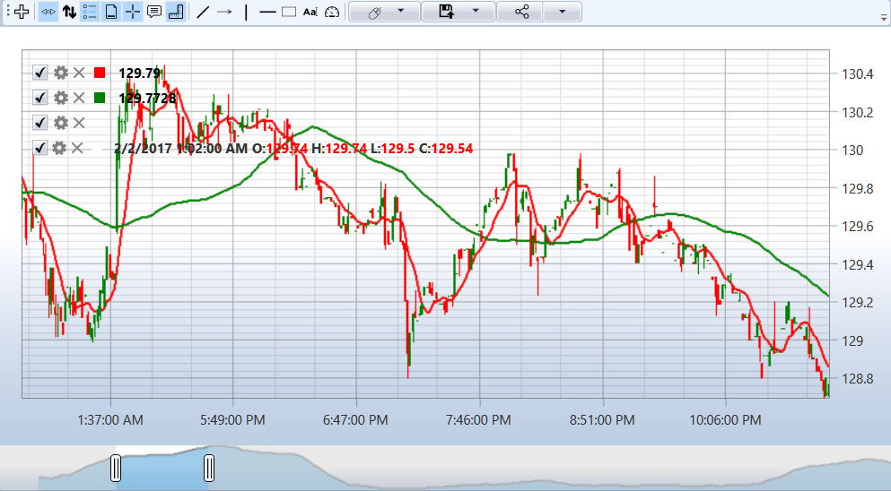

# Chart

For a candles graphic display, you can use the special [Chart](xref:StockSharp.Xaml.Charting.Chart) component, which draws candles as follows: (see [Chart components](GUICharting.md)):



The candles passed into the [ChartHelper.Draw](xref:StockSharp.Xaml.Charting.ChartHelper.Draw) method for displaying.

The current candle changes will be displayed when the candle is passed from the [Connector.CandleSeriesProcessing](xref:StockSharp.Algo.Connector.CandleSeriesProcessing) event to draw on the graph.

If you want to display the finished candles, check the [State](xref:StockSharp.Algo.Candles.Candle.State) property of candle that came:

```cs
// _chart - StockSharp.Xaml.Chart
// a new chart area
private ChartArea _areaComb;
private ChartCandleElement _candleElement;
...
var series = new CandleSeries(typeof(TimeFrameCandle),_security,TimeSpan.FromMinutes(_timeframe));
_candleElement = new ChartCandleElement() { FullTitle = "Candles" };
Chart.AddElement(_areaComb, _candleElement, series);
...
_connector.SubscribeCandles(series, DateTime.Today.Subtract(TimeSpan.FromDays(5)), DateTime.Now);			
_connector.CandleSeriesProcessing += Connector_CandleSeriesProcessing;
...
private void Connector_CandleSeriesProcessing(CandleSeries candleSeries, Candle candle)
{
    if (candle.State == CandleStates.Finished) 
    {
       var chartData = new ChartDrawData();
       chartData.Group(candle.OpenTime).Add(_candleElement, candle);
       Chart.Draw(chartData);
    }
}
		
```

## Recommended content

[Chart components](GUICharting.md)
