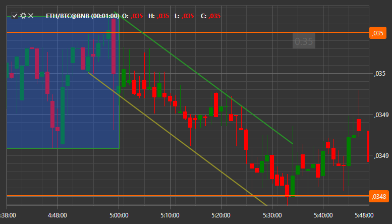

# Annotations

[S\#](StockSharpAbout.md) provides the ability to add annotations to the chart in the form of text, lines, etc.



Adding annotations is the same as adding any other information to the chart. First you need to create [ChartAnnotation](xref:StockSharp.Xaml.Charting.ChartAnnotation) and add it to the chart area:

```cs
var _annotation = new ChartAnnotation { Type = ChartAnnotationTypes.BoxAnnotation };
Chart.AddElement(chartArea, _annotation);
		
```

After that, you need to initialize a new instance of the [AnnotationData](xref:StockSharp.Xaml.Charting.ChartDrawData.AnnotationData), class, in which to describe the annotation and pass it to the [Chart.Draw](xref:StockSharp.Xaml.Charting.Chart.Draw) method for drawing on the chart:

```cs
var data = new ChartDrawData.AnnotationData
{
    X1 = new DateTimeOffset(2017, 10, 02, 8, 30, 0, TimeSpan.FromHours(1)),
    X2 = new DateTimeOffset(2017, 10, 02, 10, 30, 0, TimeSpan.FromHours(1)),
    Y1 = 193.5m,
    Y2 = 194m,
    IsVisible = true,
    Stroke = new SolidColorBrush(Color.FromRgb(0, 0, 255)),
    Thickness = new Thickness(3),
    Text = "New annotation",
    HorizontalAlignment = HorizontalAlignment.Stretch,
    VerticalAlignment = VerticalAlignment.Stretch,
    LabelPlacement = LabelPlacement.Axis,
    ShowLabel = true,
    CoordinateMode = AnnotationCoordinateMode.Absolute,
};
var drawData = new ChartDrawData();
drawData.Add(_annotation, data);
Chart.Draw(drawData);
		
```
