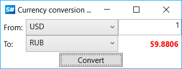

# Currency converter

To work with multi\-currency algorithms, it is necessary to use the [Currency](../api/StockSharp.Messages.Currency.html). The [S\#](StockSharpAbout.md) provides mechanism for currency conversion from one to another. In the SampleCurrency example in the distribution kit, calculator for conversion of any currencies is presented.

### Currency conversion example

Currency conversion example

1. Below see the partial code from SampleCurrency, converting from one currency to another: 

   ```cs
   var currency \= new Currency
   {
   	Type \= (CurrencyTypes)this.SourceCurrencyType.GetSelectedValue\<CurrencyTypes\>(),
   	Value \= this.Amount.Text.To\<decimal\>(),
   };
   \/\/ doing the conversation
   this.Result.Content \= currency.Convert((CurrencyTypes)this.TargetCurrencyType.GetSelectedValue\<CurrencyTypes\>()).Value;
   ```
2. The following shall be written to find out the conversion rate: 

   ```cs
   \/\/ Euro into USD
   var rate \= CurrencyTypes.EUR.Convert(CurrencyTypes.USD);
   ```
3. Additionally, the [S\#](StockSharpAbout.md) provides ability to find out the conversion rate history: 

   ```cs
   \/\/ Euro into USD (prev day)
   var rate \= CurrencyTypes.EUR.Convert(CurrencyTypes.USD, DateTime.Today \- TimeSpan.FromDays(1));
   ```
4. Here is an example of currency conversion: 

   

## Recommended content
