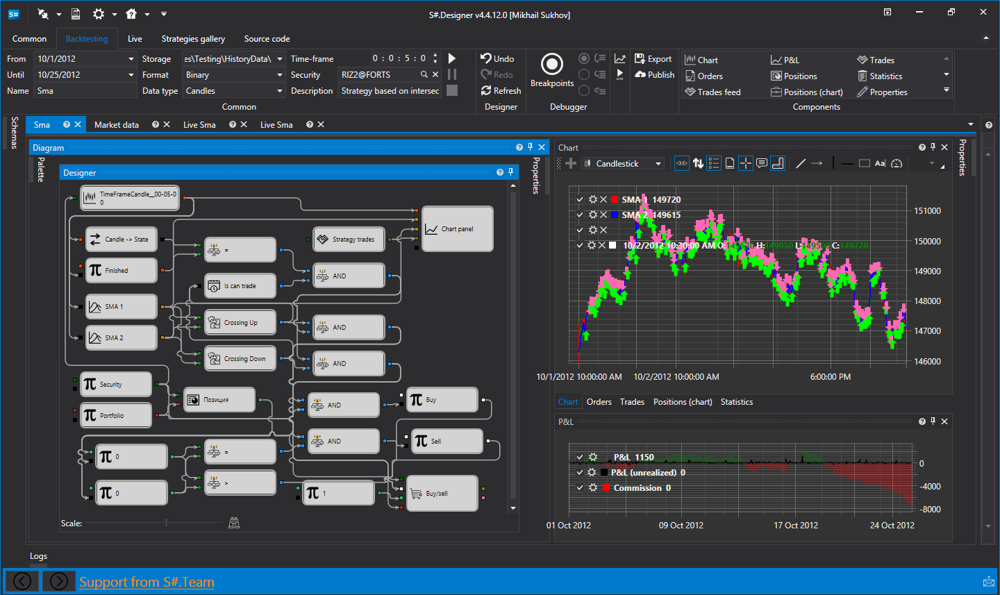

# Designer

**Designer** is a program that allows you to create trading strategies, test them on history and manage strategies for real trading. Designer offers the following types of strategy creating: 

1. [Using visual designer](designer/strategies/using_visual_designer.md), it does not require programming skills. The process of creating a strategy is accomplished by combining cubes and connections (lines). At the same time, the whole process of work is visually represented.
2. [Using C\#](designer/strategies/using_csharp.md), it is for experienced programmers who prefer to work with the code. Strategies written in **C\#** work much faster than strategies written in a visual designer. Also, such strategies are not limited in the capabilities at creation, and it is possible to write any algorithm, unlike cubes. The process of the strategy creating runs directly in **Designer** or the development environment in C\# (the most popular of the development environments is **Microsoft Visual Studio**), using the library for professional development of trading algorithms in **C\#** and [API](api.md).

## Recommended content

[Installing Designer](designer/installing_designer.md)
