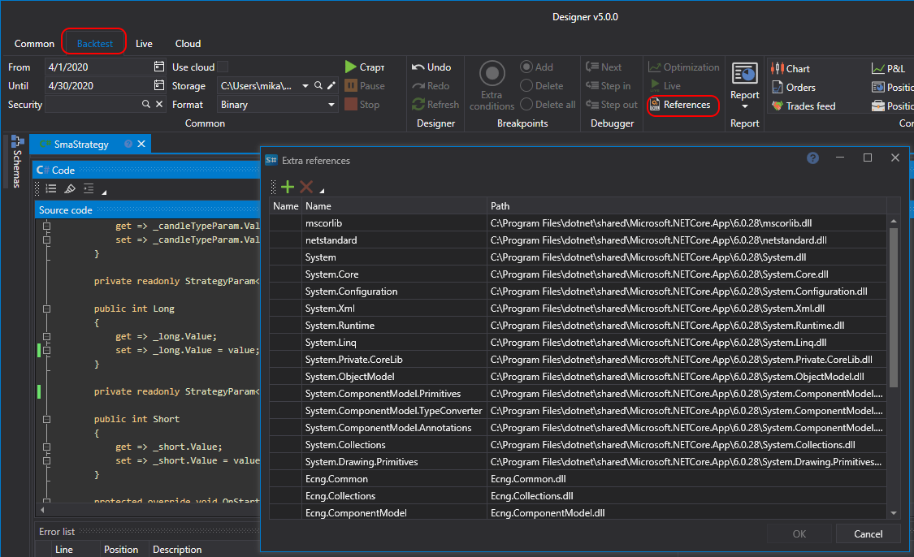

# External DLL

When you create your own **Source code** cube, you can use other C\# libraries, including your own, along with the [S\#.API](StockSharpAbout.md) libraries.

Clicking the **References** button of the **Source code** tab opens the **Extra references** window, where you can add or remove the Dll library.

## Recommended content
