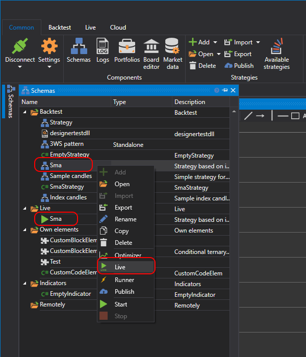
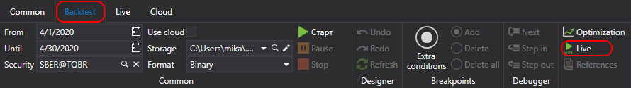

# Getting started

To add a strategy to **Live trading**, in the [Schemas](Designer_Panel_Schemas.md) panel right\-click the required strategy from the **Strategies** folder and select **Trade**. The strategy will be added to the **Trade** folder of the **Schemas** panel.

Also, you can add a strategy to Live trade by clicking the **Trade** button on the **Emulation** tab.

The Trade folder contains the strategies, added for running in Live\-trade. At that, the running strategies are marked with the , sign, and the stopped strategies \- with the  sign.

## Recommended content

[User interface](Designer_Live_trade_interface.md)
