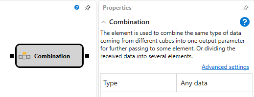

# Combination

The cube is used to combine the same type of data coming from different cubes into one output parameter for further passing to some element. Or dividing the received data into several elements.

### Incoming sockets

Incoming sockets

- **Any data** \- specifies the type of data received and passed.

### Outgoing sockets

Outgoing sockets

- **Any data** \- specifies the type of data received and passed.

### Parameters

Parameters

- **Type** \- specifies the type of data received and passed.

## Recommended content

[Position](Designer_Position.md)
