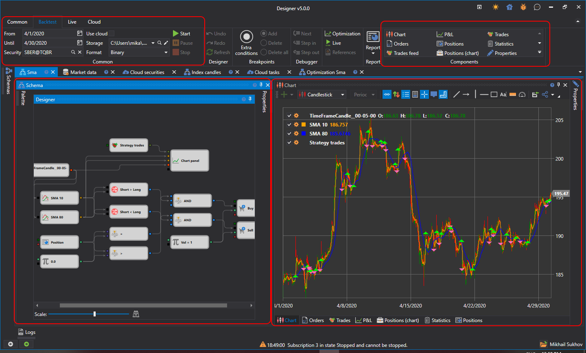

# User interface

To run the test on the history, you shall select a strategy, the scheme of which will be tested on the history. The strategy is selected on the [Schemas](Designer_Panel_Schemas.md) panel in the strategy folder, by double clicking on the strategy of interest. When you select a strategy for the workspace, a new tab with a strategy appears, when you switch to this tab, the **Emulation** tab will automatically open in the Ribbon.

On the **Emulation** tab, you can change the strategy name and give it a brief description.

To run the test on the history, on the **Emulation tab** specify the path to the historical data in the Market Data field and set the testing period. The strategy for testing is started by clicking the **Start button** . After starting the strategy for testing, the **Pause**  button, suspending the testing and the **Stop**  button, completely stopping the testing, become active. When editing the strategy, the **Undo(Ctrl+Z)** , canceling the last action, **Redo(Ctrl+Y)** , returning undo, **Refresh(Ctrl+R)** , completely updating the scheme, buttons will be useful. Also, from the **Emulation tab** you can use the **Debugger** ([Debugging](Designer_Debug.md)) or run strategy **Optimization**.

The selected strategy tab contains the following panels by default:

- The **Scheme** panel, in which the main working process on the strategy and its components design is performed, by combining cubes and connecting lines. The Scheme is described in detail in the [Diagram panel](Designer_Designer_schemes_strategies_and_component_elements.md) section.
- Panel of information elements, containing the **Chart**, **Orders**, **Trades**, **Statistics** and other components. You can add required component, selecting it on the **Emulation** tab in the **Components** group.
- The **Properties** panel by default is fold up on the right side in the strategy tab. On the **Properties** panel, you can arrange the **Emulation** general settings. For example, the **Market\-data storage format** can be set to **BIN** or **CSV**, depending on the file format of the selected storage. Data type Ticks or Candles. If Ticks is selected, candles will be formed from the [Backtesting settings](Designer_Properties_emulation.md) ticks.

## Recommended content

[Backtesting settings](Designer_Properties_emulation.md)
