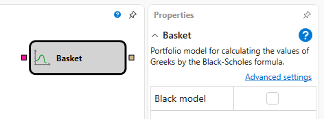
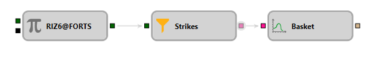

# Basket

This block is used to create an option pricing model.

### Incoming Sockets

Incoming Sockets

- **Options** – the strikes for which the model needs to be created.

### Outgoing Sockets

Outgoing Sockets

- **Model** – the pricing model (for example, Black-Scholes).

### Parameters

Parameters

- **Black Model** – a flag indicating whether to create a Black-Scholes model.

## See Also

[Black-Scholes](Designer_Black_Scholes.md)