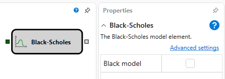

# Black Scholes

The cube is used to calculate the main Greeks: Delta, Gamma, Vega, Theta, Ro at the current time.

### Incoming sockets

Incoming sockets

- **Price of underlying asset** \- the price of the underlying asset.
- **Options** \- the list of options from the **Derivative** cube.
- **Maximum deviation** \- the maximum deviation.

### Outgoing sockets

Outgoing sockets

- **Result** \- the result of calculating the main Greeks: Delta, Gamma, Vega, Theta, Po at the current time.

### Parameters

Parameters

- **Black model** \- the flag, indicating whether values will be calculated according to the Black\-Scholes model.
- **Value** \- can take the values of Delta, Gamma, Vega, Theta, Po and determines what value will be at the cube output.

## Recommended content

[Hedging](Designer_Hedging.md)
