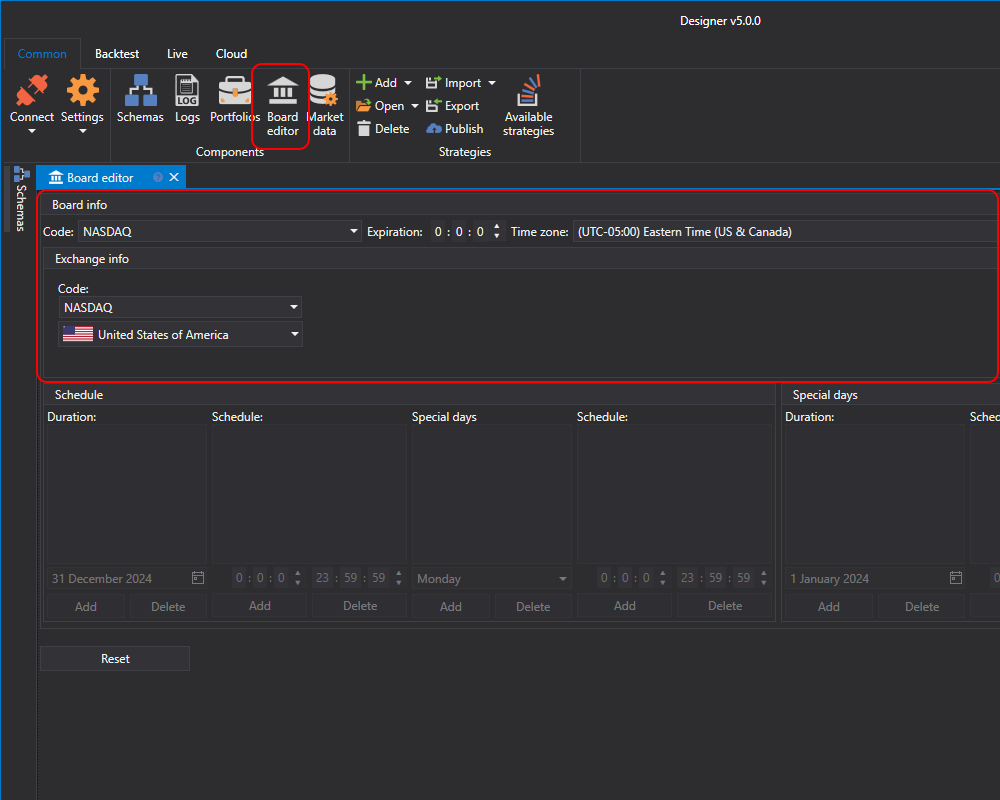

# Boards

In the **Board editor** panel, you can create **Boards** and **Exchanges**, and view or customize existing ones.

In [S\#](StockSharpAbout.md), instruments from different sources have a unified identifier that consists of the instrument code and the board code and the following syntax is used \- \[**instrument code\]@\[board code\]**. For example, for **AAPL** shares of the **NASDAQ** exchange, the identifier is **AAPL@NASDAQ**. Each instrument is attached to a specific board on which it is traded. With that, the instrument can be traded on different boards. In this case, the board codes will be different. For each board, you can set up a work schedule, work days and weekends.

The exchange may have several boards with different terms of trade (session time, commission, etc.). But each board is attached to a specific exchange. Therefore, in the **Board editor**, when you select a board, the information about the exchange will automatically be changed, to the exchange on which the board is to be placed. For each exchange, you can set the exchange's code, country, Russian\-language and English\-language names.
