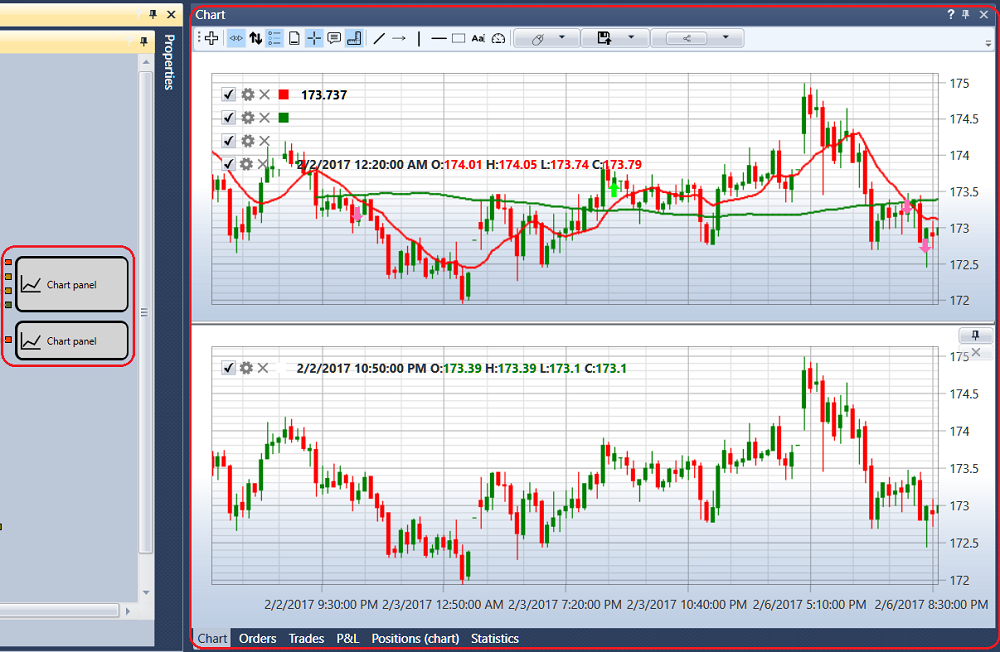
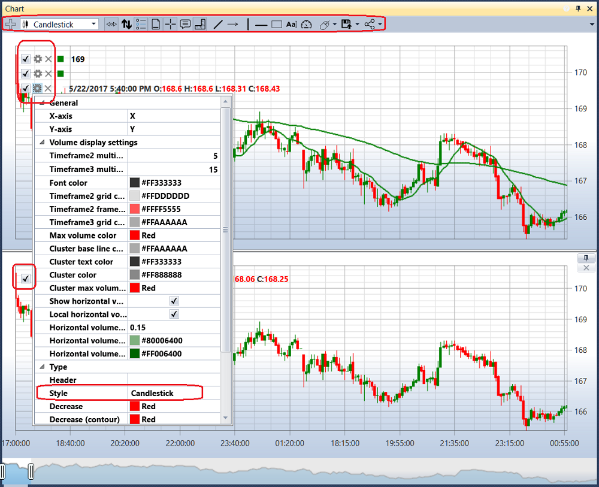
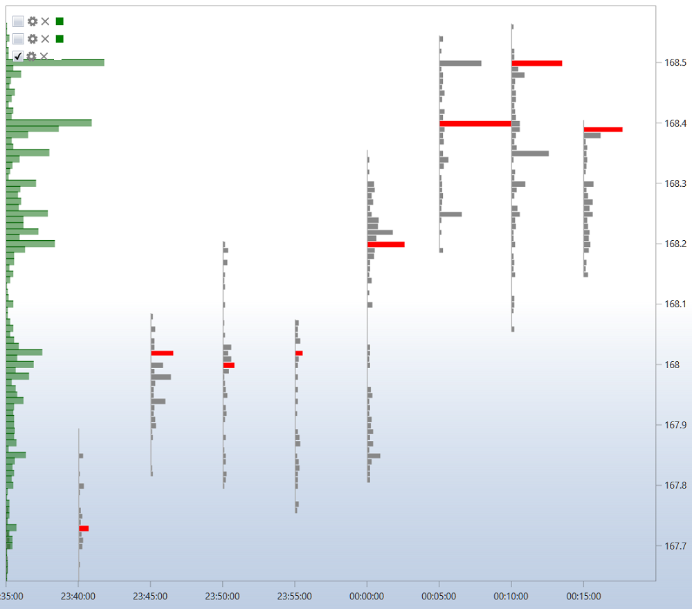
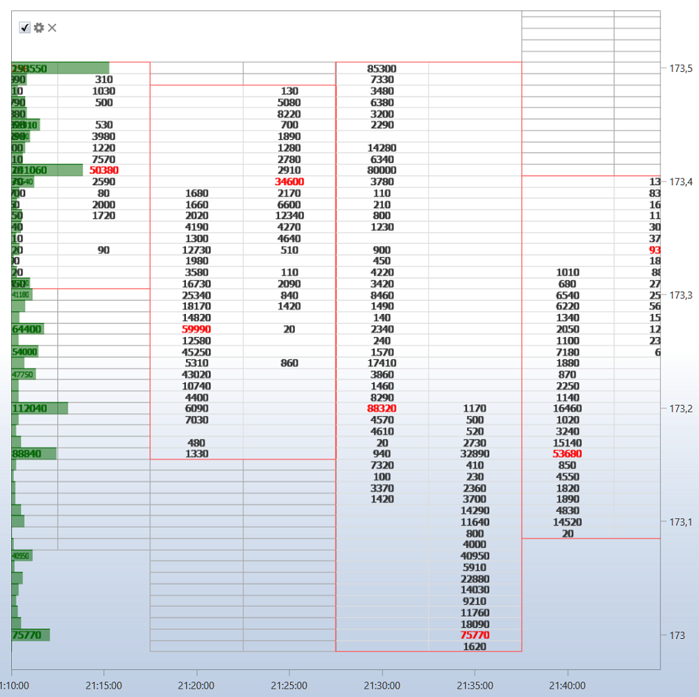
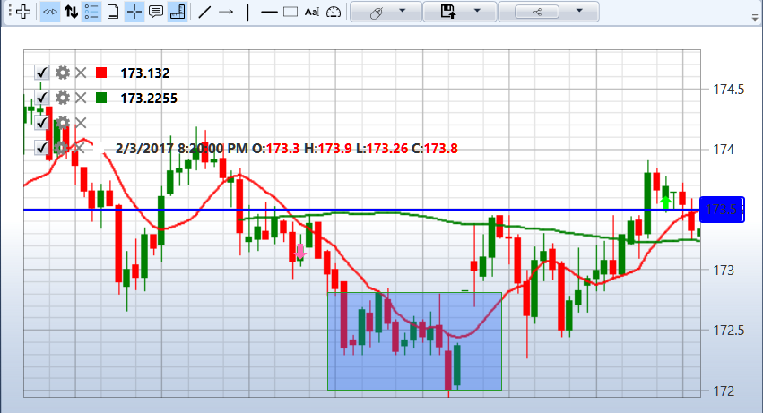

# Chart

The **Chart** component contains all the **Chart panel** cubes that are in the strategy. For example, if the strategy uses two **Chart panel** cubes, then in the **Chart** component 2 charts are displayed, as in the figure.

The top left corner of each chart shows all the graphical elements added to the chart. If you clear the check box on the  graphic element, the element will be removed from the chart. Click on the  button will open the settings for the graphic element. Also, you can set up the graphic element in the [Chart](Designer_Panel_graphics.md) cube properties.

In the graphical element settings, you can set the required chart style: Japanese candles, bars, box chart, cluster profile, etc.

For a box chart candles can be additionally grouped, the grouping order is set in the fields: the multiplier of the 2nd timeframe, the multiplier of the 3rd timeframe.

There is a toolbar above the chart, where you can select auto scroll, auto\-zoom, legend modes and other general chart settings. You can also select the elements to draw on the chart: lines, levels, pointers, rectangle, text.

## Recommended content

[Orders](Designer_Orders.md)
