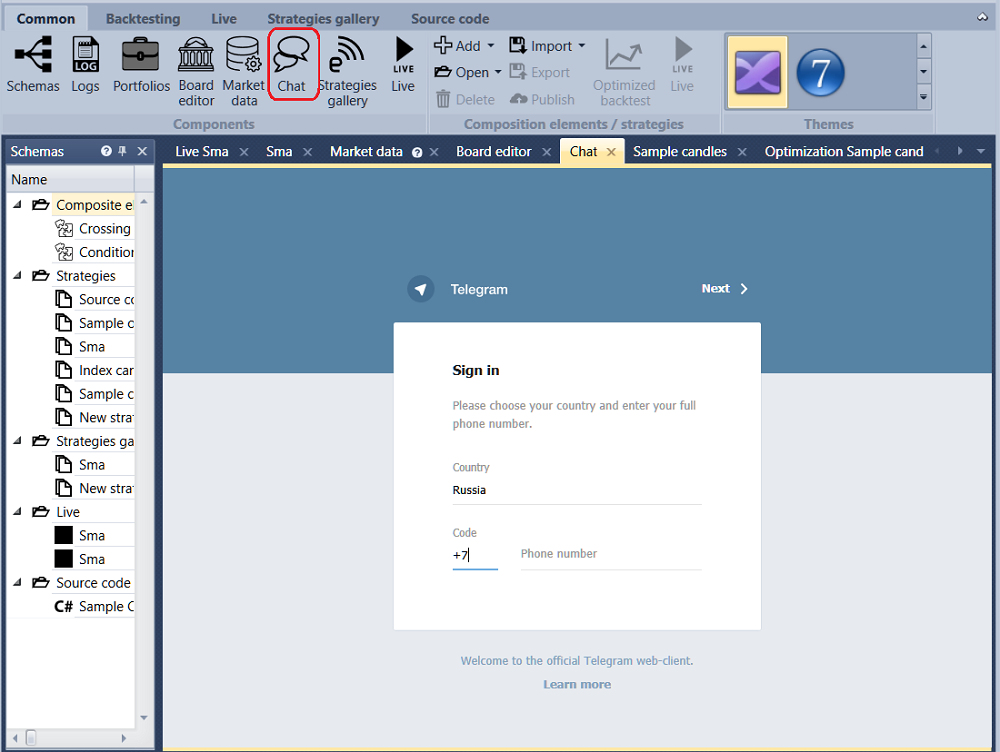
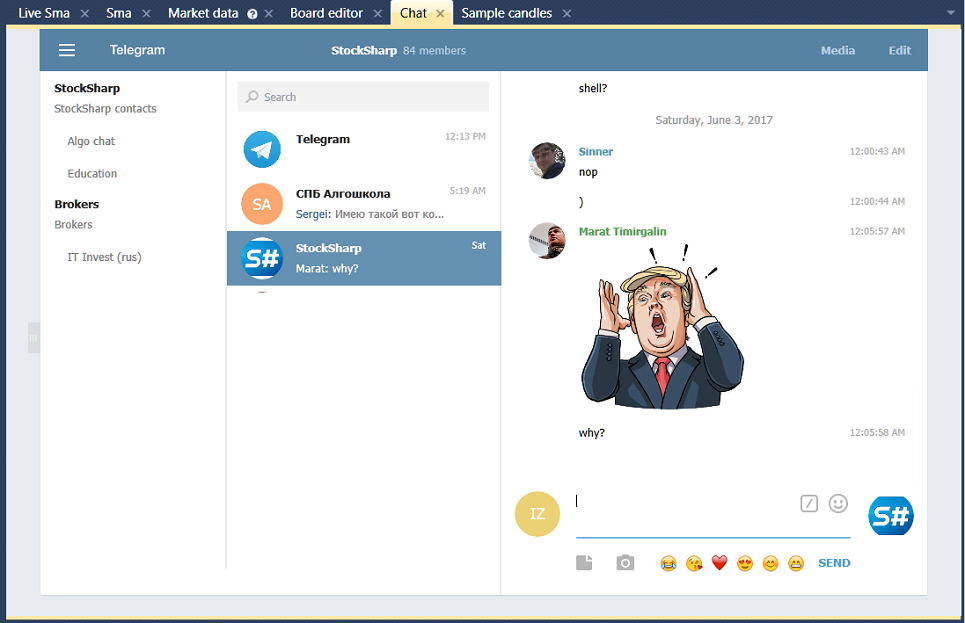

# Chat

For team work, it's convenient to use the built\-in **Chat**, which is a popular **Telegram** messenger in the Web interface.

Using the [S\#.Designer](Designer.md) chat on the basis of the **Telegram** messenger has the following advantages:

- Protection against unauthorized reading is provided through the use of the MTProto communication protocol.
- Secret chats provide end\-to\-end encryption, the history of which is not stored on any server, providing anonymity of correspondence.
- Availability of a timer for messages self\-destruction.
- Instant delivery of messages and files.
- Ability to transfer files of any format with the size up to 1.5 Gb.
- The Telegram messenger works on IPhone, Android, WindowsPhone. There are online and desktop versions. There is an ability of synchronization between devices.
- Creation of large chats \- up to 5000 members.

When you first open the **Chat**, an authorization page appears, where you need to enter your phone number and wait for the SMS with the activation code. After authorization, you get a full\-featured **Telegram** messenger directly in the [S\#.Designer](Designer.md).

After registration, the window will look like this:

## Recommended content
