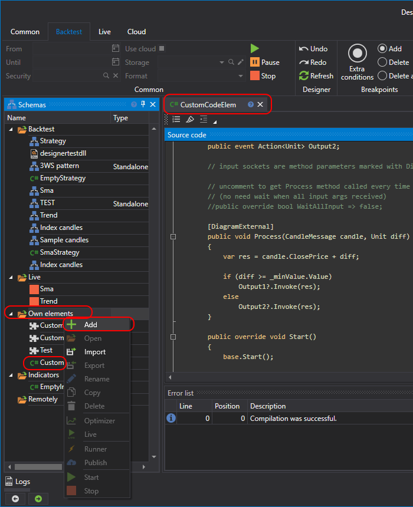
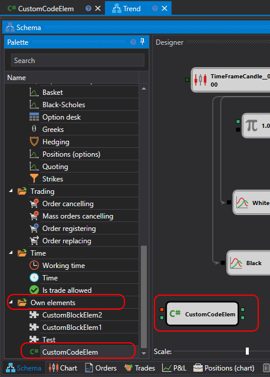

# Creating Your Own Cube

Similar to creating a [cube from a diagram](Designer_Creating_composite_elements.md), you can create your own cube based on C# code. Such a cube will be more functional than a cube from a diagram.

To create a cube from code, it needs to be created in the **Own elements** folder:



The code for an empty cube looks as follows:

```cs
/// <summary>
/// Sample diagram element demonstrates input and output sockets usage.
/// 
/// https://doc.stocksharp.com/topics/Designer_Combine_Source_code_and_standard_elements.html
/// </summary>
public class EmptyDiagramElement : DiagramExternalElement
{
	private readonly DiagramElementParam<int> _minValue;

	public EmptyDiagramElement()
	{
		// example property to show how to make parameters
	
		_minValue = AddParam("MinValue", 10)
			.SetBasic(true) // make parameter visible in basic mode
			.SetDisplay("Parameters", "Min value", "Min value parameter description", 10);
	}

	// output sockets are events marked with DiagramExternal attribute

	[DiagramExternal]
	public event Action<Unit> Output1;

	[DiagramExternal]
	public event Action<Unit> Output2;

	// input sockets are method parameters marked with DiagramExternal attribute

	// uncomment to get Process method called every time when new arg received
	// (no need wait when all input args received)
	//public override bool WaitAllInput => false;

	[DiagramExternal]
	public void Process(CandleMessage candle, Unit diff)
	{
		var res = candle.ClosePrice + diff;

		if (diff >= _minValue.Value)
			Output1?.Invoke(res);
		else
			Output2?.Invoke(res);
	}

	public override void Start()
	{
		base.Start();

		// add logic before start
	}

	public override void Stop()
	{
		base.Stop();

		// add logic after stop
	}

	public override void Reset()
	{
		base.Reset();

		// add logic for reset internal state
	}
}
```

This code shows how to create a cube that has two incoming sockets and two outgoing. Incoming sockets are defined by applying the [DiagramExternalAttribute](xref:StockSharp.Diagram.DiagramExternalAttribute) attribute to the method:

```cs
[DiagramExternal]
public void Process(CandleMessage candle, Unit diff)
```

Outgoing sockets are defined by applying the attribute to an event. In the example of the cube, there are two such events:


```cs
[DiagramExternal]
public event Action<Unit> Output1;

[DiagramExternal]
public event Action<Unit> Output2;
```

Therefore, there will also be two outgoing sockets.

Additionally, it shows how to make a property for the cube:

```cs
_minValue = AddParam("MinValue", 10)
	.SetBasic(true) // make parameter visible in basic mode
	.SetDisplay("Parameters", "Min value", "Min value parameter description", 10);
```

Using the [DiagramElementParam](xref:StockSharp.Diagram.DiagramElementParam`1) class automatically employs the approach to save and restore settings.

The **MinValue** property is marked as basic, and it will be visible in the [Basic properties](Designer_Designer_schemes_strategies_and_component_elements.md) mode.

The commented [WaitAllInput](xref:StockSharp.Diagram.DiagramExternalElement.WaitAllInput) property is responsible for the timing of the method call with incoming sockets:

```cs
//public override bool WaitAllInput => false;
```

If uncommented, the **Process** method will always be called as soon as at least one value arrives (in the example case, this is either a candle or a numerical value).

To add the resulting cube to the diagram, you need to select the created cube in the palette in the **Own elements** section:



> [!WARNING] 
> Cubes from C# code cannot be used in strategies created in C# code. They can only be used in strategies created [from cubes](Designer_Creating_strategy_out_of_blocks.md).

## See Also

[Creating an Indicator in C#](Designer_Creating_indicator_from_source_code.md)