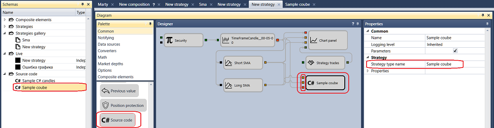

# Combine C\# code and visual designer

An example of writing the SMA strategy code, given in the [First C\# strategy](Designer_Creating_strategy_from_source_code.md) section, can be optimized by a competent combination of [Source code](Designer_Source_code.md) cubes and standard cubes. We take out from the code all actions of the strategy, which are easier to create from the standard [Indicator](Designer_Indicator.md), [Chart](Designer_Panel_graphics.md), [Trades by strategy](Designer_Trades_strategy.md) cubes.

Since the SMA Indicators were placed in separate cubes, you need to rewrite the ProcessCandle(Candle candle) method so that it takes two ProcessCandle(DecimalIndicatorValue ssma, DecimalIndicatorValue lsma, Candle candle) indicators in addition to (Candle candle) candles. And on the basis of these values, it calculates the strategy. And also, it is necessary to delete all superfluous in the code. The final version of the cube source code looks like this:

```cs
using Ecng.Common;
using StockSharp.Messages;
using StockSharp.Algo;
using StockSharp.Algo.Candles;
using StockSharp.Algo.Strategies;
using StockSharp.Algo.Indicators;
using StockSharp.Xaml.Diagram.Elements;
public class NewStrategy : Strategy
{
    private bool _isShortLessThenLong;
    [DiagramExternal]
    public void ProcessCandle(DecimalIndicatorValue ssma, DecimalIndicatorValue lsma, Candle candle)
    {
        // strategy are stopping
        if (ProcessState == ProcessStates.Stopping)
        {
            CancelActiveOrders();
            return;
        }
        // calc new values for short and long
        var isShortLessThenLong = ssma.Value < lsma.Value;
        // crossing happened
        if (_isShortLessThenLong != isShortLessThenLong)
        {
            // if short less than long, the sale, otherwise buy
            var direction = isShortLessThenLong ? Sides.Sell : Sides.Buy;
            // calc size for open position or revert
            var volume = Position == 0 ? Volume : Position.Abs().Min(Volume) * 2;
            // calc order price as a close price + offset
            var price = candle.ClosePrice + ((direction == Sides.Buy ? Security.PriceStep : -Security.PriceStep) ?? 1);
            RegisterOrder(this.CreateOrder(direction, price, volume));
            // store current values for short and long
            _isShortLessThenLong = isShortLessThenLong;
        }
    }
}
```

It is necessary to put [Variable](Designer_Variable.md) cubes with the Instrument Type, [Candles](Designer_Candles.md), 2 [Indicator](Designer_Indicator.md) SMA, [Chart](Designer_Panel_graphics.md), [Trades by strategy](Designer_Trades_strategy.md) on the common schema. How to do this is described in detail in the [First strategy](Designer_Algorithm_creation_of_elements.md) section. Also, it is necessary to put on the common schema the [Source code](Designer_Source_code.md) cube, having moved it to the **Designer** panel from the **Palette** panel. You should select the name of the strategy in the [Source code](Designer_Source_code.md) cube properties. Since the **ProcessCandle(DecimalIndicatorValue ssma, DecimalIndicatorValue lsma, Candle candle)** method takes three parameters, then there will be three parameters at the cube input. The first two parameters are of the Indicator value type, and the third is of the **Candle** type. By connecting all the cubes with lines, we get the following schema:



As a result, the strategy code has decreased from 213 lines to 43. But only 4 standard cubes were added. If you compare with the same strategy created from cubes in the [Using visual designer](Designer_Creating_strategy_out_of_blocks.md) section, the number of cubes decreased from 17 to 7. 

## Recommended content

[Create DLL in Visual Studio](Designer_Creating_DLL_element_in_Visual_Studio.md)
