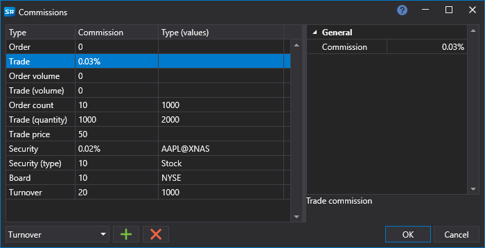

# Commissions

In the [Backtesting settings](Designer_Properties_emulation.md) panel, you can set the commission monitoring settings.

In the **Commissions** window, you should select the type of commission, set the commission value and the condition under which the commission will be charged.

#### List of commission types

List of commission types

- **Orders (number)** – the commission for the number of orders.
- **Order** – the commission for the order.
- **Order (volume)** – the commission for the volume in the order.
- **Trade (number)** – the commission for the number of trades.
- **Trade (price)** – the commission for the trade price.
- **Trade** – the commission for the trade.
- **Trade (volume)** – the commission for the volume in the order.
- **Security** – the instrument commission.
- **Security (type)** – the instrument type commission.
- **Turnover** – the commission for turnover.
- **Board** – the board commission.
