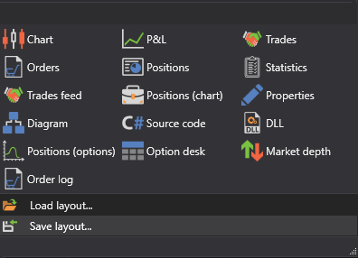

# Components

During testing or trade there is a need to fully control the process. For complete control and analysis, [S\#.Designer](Designer.md) provides graphical components that you can add by selecting them in the **Components** group of the **Ribbon**:

- [Portfolios](Designer_Panel_Portfolios.md) \- is a table that shows the basic data on the portfolio, and the current positions for these portfolios.
- [Chart](Designer_Chart.md) \- is a chart of candles or indicators, that contains all the [Chart](Designer_Panel_graphics.md), cubes that are in the strategy.
- [P&L equity](Designer_Panel_Market_depth.md) \- is a chart of the Profit\/Loss (not realized), Profit\/Loss (realized) and commission.
- [Trades](Designer_Trades.md) \- is a table with trades, that displays complete information about all trades of the strategy.
- [Orders](Designer_Orders.md) \- is a table with orders, that displays complete information about all orders of the strategy.
- [Conditional orders](Designer_Orders_conditional.md) \- is a table with conditional orders, that displays complete information about all conditional orders of the strategy.
- [Positions](Designer_Chart_Position.md) \- is a table of positions for strategy instruments.
- [Statistics](Designer_Statistics.md) \- is a table, grouped by categories: Orders, P\/L, Trade positions.
- [Tick trades](Designer_Tape_Trades.md) \- is a table with trades, that displays complete information about all trades for the selected instruments.
- [Positions](Designer_Chart_Position.md) chart \- is a chart of the Position.
- Properties \- is the [Backtesting settings](Designer_Properties_emulation.md) table or the [Live settings](Designer_Properties_Live.md) table.
- Diagram \- is the [Diagram panel](Designer_Designer_schemes_strategies_and_component_elements.md).
- [Chart positions](Designer_Graph_options_positions.md) \- is a chart of options positions.
- [Option desk](Designer_Options_Board.md) \- is an options table.
- [Order book](Designer_Depth_Panel2.md) \- is a table of limit orders for purchase and sale.

## Recommended content
