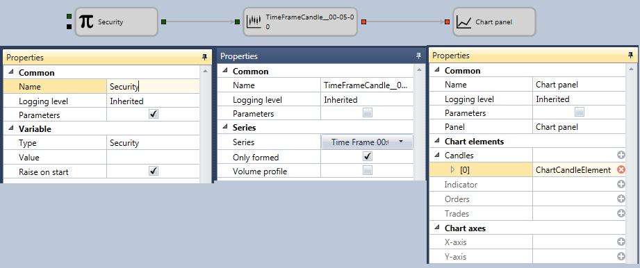

# Display candles on chart

To output candles by an instrument to a chart, the following schema can be used:

For the [Variable](Designer_Variable.md) cube, the **Instrument** data type is selected. If the instrument is not specified, but the **Parameters** flag of the **Common** properties group is set, it will be taken from the strategy and passed to the [Candles](Designer_Candles.md) cube. For the [Candles](Designer_Candles.md) cube, the settings for building 5\-minute candles and passing only fully formed candles are specified.

For the [Chart](Designer_Panel_graphics.md) cube, one graphic element with a candle type was added, for which the input parameter was automatically added.

After adding the necessary graphic elements to the chart panel, the connection of the [Candles](Designer_Candles.md) and [Chart](Designer_Panel_graphics.md), elements is added, through which the built candles will be passed for output to the chart.

## Recommended content

[Get best price for instrument](Designer_Get_best_quote_for_instrument.md)
