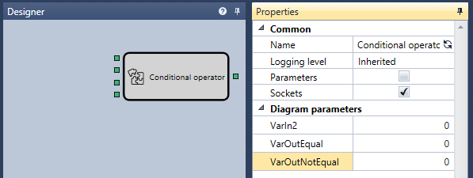
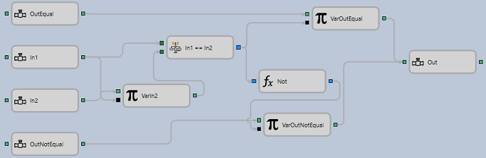

# Conditional operator

The conditional statement element returns one of two values, depending on the equality of the two input parameters. The element contains four inputs, three of which can be specified as properties, and one output. In1 and In2 are used for comparison, OutEqual and OutNotEqual are used to specify the values that will be returned at the output of the element, depending on the equality of the input parameters. Values for OutEqual, OutNotEqual and In2 can be specified in the properties of the element, the value of In1 must necessarily be passed through the input parameter.

#### Incoming sockets

Incoming sockets

- **In1** – values that can be compared (for example, a numeric value, a string, an indicator value, etc.).
- **In2** – values that can be compared (for example, a numeric value, a string, an indicator value, etc.).
- **OutEqual** – the value that will be returned at the output of the element, depending on the equality of the input parameters.
- **OutNotEqual ** – the value that will be returned at the output of the element, depending on the equality of the input parameters.

#### Outgoing sockets

Outgoing sockets

- **Result** \- the numeric value.

#### Parameters

Parameters

- **In2** \- values that can be compared (for example, a numeric value, a string, an indicator value, etc.).
- **OutEqual** \- the value that will be returned at the output of the element, depending on the equality of the input parameters.
- **OutNotEqual** \- the value that will be returned at the output of the element, depending on the equality of the input parameters.

The element diagram consists of simple elements and is based on memorization in the [Variable](Designer_Variable.md) element (VarIn2, VarOutEqual, VarOutNotEqual) the values that were passed to the element input, or using the default values that are set using the element's properties. When a new value is received, the first input compares (In1 \=\= In2) a new value with the value that was stored in the variable for the second input. If the values are the same, a signal is passed to the input\-trigger of the VarOutEqual variable and the corresponding value is passed to the output of the composite element Similarly, the signal is passed to the variable element VarOutNotEqual using a logical negation (Not).

## Recommended content

[Lines](Designer_Line.md)
