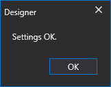

# Connections settings

1. When clicking the arrow next to the **Connect** button, the **Connection settings** button appears:

2. When clicking the **Connection settings** button, the **Connection settings** window opens:

The Connection settings window is divided to 3 areas.

3. Clicking the  button activates the drop\-down list of supported connectors. The selected connectors are displayed in the area No. 1. The  button removes the selected connector. The first column of the area No. 1 displays whether the connector will connect when you click the Connect  button or will not connect . These values are set using the  and  buttons.

The **Market data** and **Trades** display, whether the connector supports market data and work with orders.

4. When the **Auto\-connect** check box is selected, the connection is automatically connected with the start of the [Designer](Designer.md).

5. The area No. 2 displays the selected connector settings. When the  is clicked, the program redirects to documentation ([API](StockSharpAbout.md)) on the selected connector adjustment.

6. Clicking the **Check** button will check the current connector connection. If the check fails, a window with an error will appear, describing the reason for the unsuccessful connection. If the check is successful, a window will appear:

7. The area No. 3 displays data types, which will be received or transmitted by the connector. By clicking the \/  checkbox you can enable\/disable transmission or reception for this type of data.

8. Clicking the **Network settings** button will open the **Proxy\-server settings** window:

## Recommended content

[Strategies dashboard](Designer_Panel_strategies.md)
