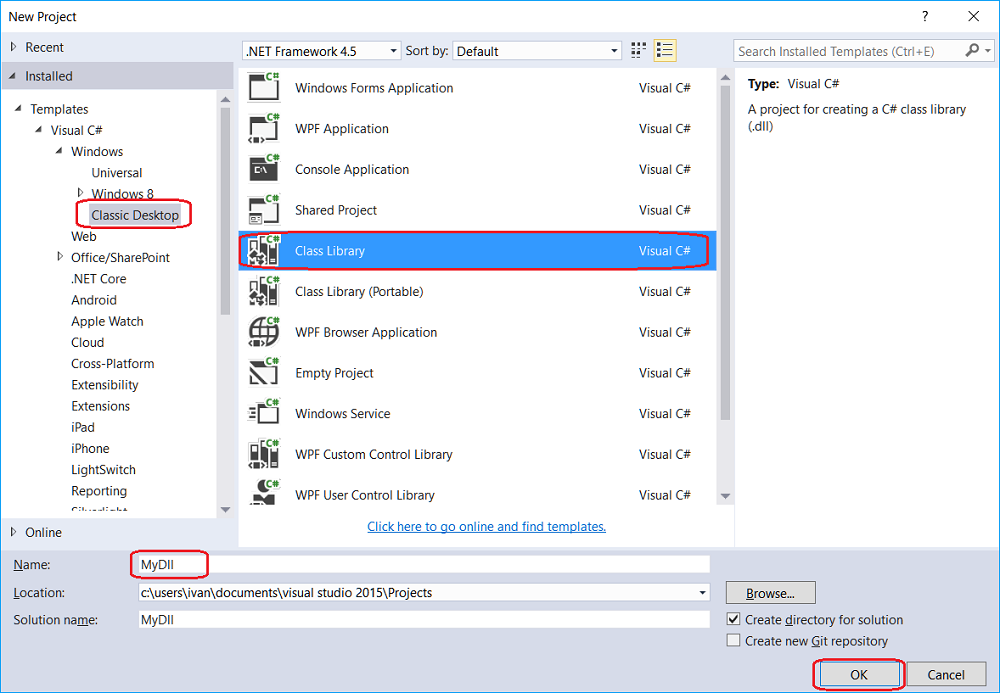
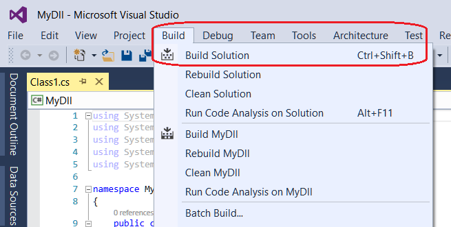
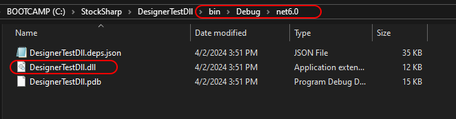
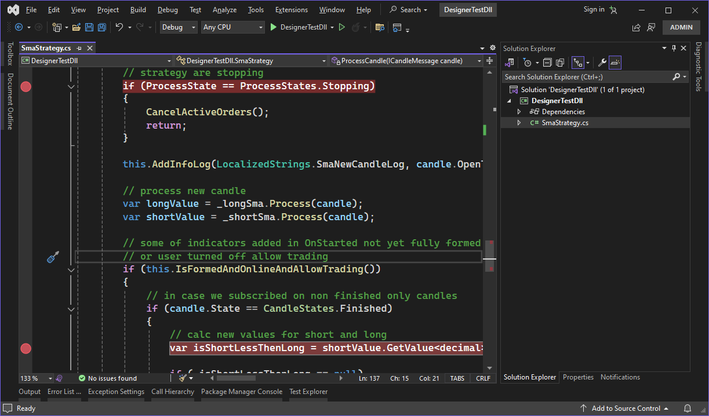

# Create DLL in Visual Studio

To write code in Visual Studio, you should create a project in Visual Studio:

It is necessary to install [API](StockSharpAbout.md) in the created project. There are two ways to install [API](StockSharpAbout.md): Installing from the [StockSharp Releases](https://github.com/StockSharp/StockSharp/releases/) repository of the GitHub web service and installing from Visual Studio using the Nuget service. The installation of [API](StockSharpAbout.md) is described in the [Installation instruction](StockSharpInstall.md) section. 

From now forward, the process of a strategy creating is the same as described in the [First C\# strategy](Designer_Creating_strategy_from_source_code.md) section. After creating the strategy, you need to compile the project by clicking **Build Solution** in the **Build** tab.

The project is build by default in a folder …\\bin\\Debug\\ .

To add Dll to the common schema, you should put the [DLL import](Designer_DLL_Strategy.md) cube, and specify Dll build in the **Build** field in the property panel. After that it will be possible to select a cube by name in the **Strategy** type name field:

## Recommended content

[Debug DLL in Visual Studio](Designer_Debugging_DLL_using_Visual_Studio.md)
