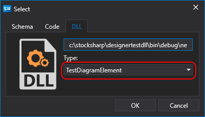
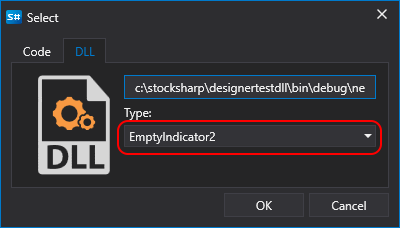

# Creating a Cube and Indicator

The algorithm for creating a cube or indicator from a DLL assembly is similar to the process from code (see the creation of a [cube](Designer_Combine_Source_code_and_standard_elements.md) and [indicator](Designer_Creating_indicator_from_source_code.md)) except for the content selection stage. Similarly, when adding a [strategy from DLL](Designer_Creating_strategy_from_dll.md), you can choose both the type of cube and indicators if they are created in the connected DLL:

When adding connected cubes or indicators to the diagram, you need to follow the steps described in the sections for a [cube](Designer_Combine_Source_code_and_standard_elements.md) or [indicator](Designer_Creating_indicator_from_source_code.md).

## See Also

[Debugging a DLL Cube with Visual Studio](Designer_Debugging_DLL_using_Visual_Studio.md)
