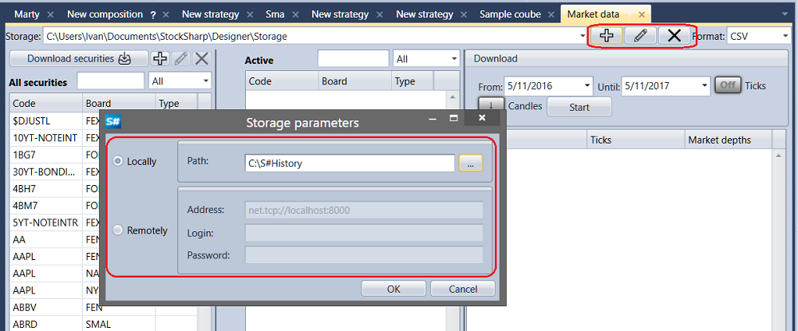
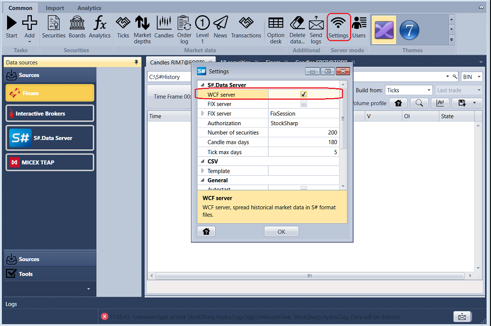
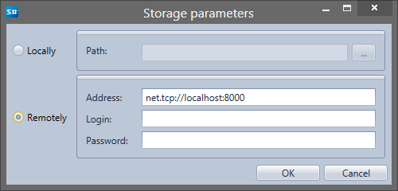

# Getting started

In order to create historical data storage, click the  button on the **Market data** tab. By clicking the  button, you can change the current storage parameters. By clicking the  button, you can delete the current storage from the list of storages.

Historical data storage can be a local or remote.

Local storage \- when all data is stored on local computer. To set the local storage, it is sufficient to set the path to the folder with stored data.

Remote storage may be located on the remote computer. To set the remote storage you have to set the remote storage address, login and password, if necessary. 

You can reproduce the remote storage on a local machine, using the [Hydra](Hydra.md) software (code name Hydra), designed for automatic loading of market data (instruments, candles, tick trades and order books etc.) from various source and for storing them in the local storage. To do that, switch [Hydra](Hydra.md) into a the server mode, such functionality is available in the extended license ([StockSharp Licensing](License.md)).

After that, in [Designer](Designer.md), create new storage by clicking the  button. In the storage settings in the address field, specify "net.tcp:\/\/localhost:8000". Click OK. When using [Hydra](Hydra.md) as a remote storage, don't forget, that [Hydra](Hydra.md) shall be started up and configured accordingly.

After adding a new storage, it can be selected in the **Storage** drop down list.

You also have to select the format of storage files \- BIN or CSV. Data can be stored in two formats: in a special binary BIN format, which provides the maximum compression ratio, or in text format CSV, which is convenient when analyzing data in other programs. The BIN format is preferred when there is a need to save space on disk. The CSV format is preferred when there is a need to adjust data manually. CSV is easily edited by standard notepad, MS Excel, etc.

## Recommended content

[Download instruments](Designer_Download_instruments.md)
