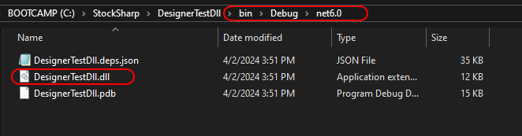
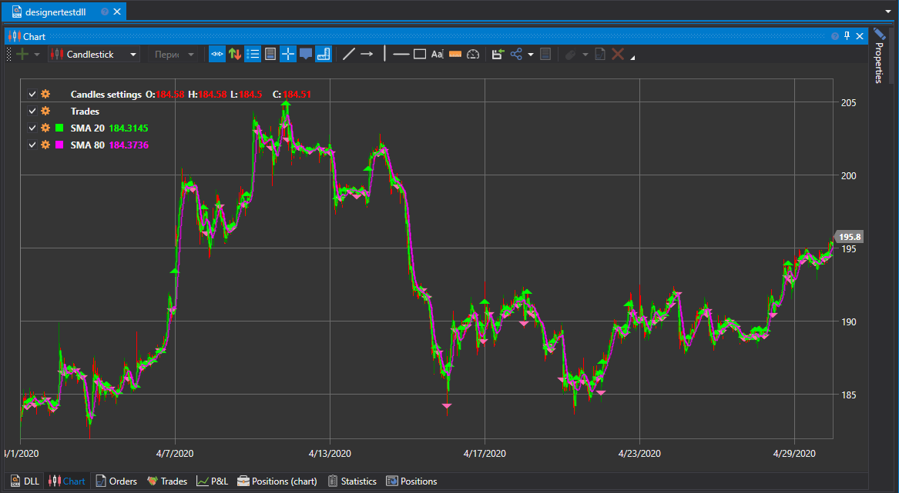

# Using DLL

Using ready-made DLLs is familiar for those who want to work continuously in **Visual Studio** and **JetBrains Rider** environments. This approach offers several advantages over writing [code](Designer_Creating_strategy_from_code.md) inside **Designer**:

- Enhanced code editor compared to the built-in editor inside **Designer**.
- Recompiling code automatically updates content inside **Designer**.
- Possibility to split code into several files (in the case of the [code](Designer_Creating_strategy_from_code.md) approach, only OneFile-OneStrategy variant is possible).
- Using the [debugger](Designer_Debugging_DLL_using_Visual_Studio.md).

### Creating a Project in Visual Studio

1. To create a strategy in **Visual Studio**, you need to create a project:

2. Next, you need to write the strategy code. For a quick start, you can copy the SmaStrategy code, which is created as a template in [strategy from code](Designer_Creating_strategy_from_source_code.md):

2. After creating the strategy, you need to build the project by pressing **Build Solution** in the **Build** tab.

3. In Visual Studio by default, the project is built into the …\\bin\\Debug\\net6.0 folder.

### Adding DLL to Designer

1. Adding a strategy from a DLL is similar to creating a strategy from [code](Designer_Creating_strategy_from_code.md). But at the content type definition stage, you need to choose **DLL**:

2. In the window, you need to specify the path to the assembly (must be compatible with .NET 6.0), and choose the type. The latter is necessary because one DLL can contain several strategies (or [cubes with indicators](Designer_Creating_DLL_element_in_Visual_Studio.md)). After clicking **OK**, the strategy will be added to the **Scheme** panel and is ready for use:

3. Launching the strategy on [backtest](Designer_Backtesting_Interface.md), on [live](Designer_Add_strategy_Live_trade.md), and other operations - works similarly to strategy from diagrams and code:

