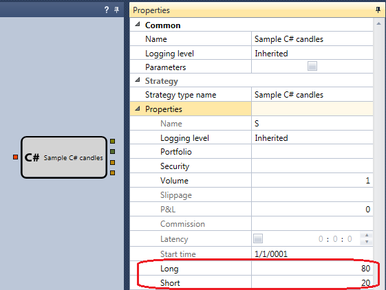

# First C\# strategy

To create strategies from the source code, you need programming skills in C\#, as well as knowledge of the library for the professional development of trading algorithms in C\# [S\#.API](StockSharpAbout.md).

Creating a strategy from the source code will be discussed on the example of the SMA strategy \- a similar to SMA example\-strategy, compiled from the cubes in the [First strategy](Designer_Algorithm_creation_of_elements.md) section.

The first line is the namespace name. It can be any combination of Latin characters, by default StockSharp.Designer.Strategies.

Next is the listing of the DLL libraries needed to run the cube code:

```cs
sing System.Windows.Media;
using System.Runtime.InteropServices;
using Ecng.Common;
using Ecng.ComponentModel;
using Ecng.Collections;
using StockSharp.Messages;
using StockSharp.Algo;
```

Dll libraries are added by clicking the **References** button in the **Source code** tab.

Then the class is declared. The class name can be any combination of Latin characters. The cube class must be inherited from the [Strategy](xref:StockSharp.Algo.Strategies.Strategy) class:

```cs
	public class NewStrategy : Strategy
```

Next, there is a declaration of variables in the example. SMA strategy requires two moving averages with different calculation periods, a long SMA and a short SMA:

```cs
 private readonly SimpleMovingAverage _long;
 private readonly SimpleMovingAverage _short;
```

The strategy parameters are declared, the SMA indicators parameters will be stored in them:

```cs
 private readonly StrategyParam<int> _longParam;
 private readonly StrategyParam<int> _shortParam;
```

Variables necessary for displaying graphic elements are also declared. They do not have a useful information and are shown in the example as a demonstration of possibilities. To display graphic elements, it is better to use [S\#.Designer](Designer.md) standard cubes. How to do this is shown in the [Combine C\# code and visual designer](Designer_Combine_Source_code_and_standard_elements.md) section:

```cs
 private readonly List<MyTrade> _myTrades = new List<MyTrade>();
 private readonly ChartCandleElement _candlesElem;
 private readonly ChartTradeElement _tradesElem;
 private readonly ChartIndicatorElement _shortElem;
 private readonly ChartIndicatorElement _longElem; 
 private readonly ChartArea _area = new ChartArea();
```

The [DiagramExternalAttribute](xref:StockSharp.Xaml.Diagram.Elements.DiagramExternalAttribute) attribute is required to indicate the input and output cube parameters. If the attribute defines an event, it means it will be an output parameter, if the method \- it means the input parameter:

```cs
 [DiagramExternal]
 public event Action<Order> NewMyOrder;
```
```cs
 [DiagramExternal]
 public void ProcessCandle(Candle candle)
```

After declaring variables, you need to set the cube properties. These properties will be displayed in the **Properties** panel in the common schema:



```cs
public int Long
{
    get { return _longParam.Value; }
    set
    {
        _longParam.Value = value;
        _long.Length = value;
    }
}
public int Short
{
    get { return _shortParam.Value; }
    set
    {
        _shortParam.Value = value;
        _short.Length = value;
    }
}
```

Initialization of variables occurs in the class constructor:

```cs
public NewStrategy()
{
    _longParam = new StrategyParam<int>(this, nameof(Long), 80);
    _shortParam = new StrategyParam<int>(this, nameof(Short), 20);
    _long = new SimpleMovingAverage { Length = Long };
    _short = new SimpleMovingAverage { Length = Short };
    
    _candlesElem = new ChartCandleElement { ShowAxisMarker = false };
    _tradesElem = new ChartTradeElement { FullTitle = LocalizedStrings.Str985 };
    _shortElem = new ChartIndicatorElement
    {
        Color = Colors.Coral,
        ShowAxisMarker = false,
        FullTitle = _short.ToString()
    };
    _longElem = new ChartIndicatorElement
    {
        ShowAxisMarker = false,
        FullTitle = _long.ToString()
    };
}
```

The [Strategy](xref:StockSharp.Algo.Strategies.Strategy) class has methods that you can override. In the example, the [Strategy.OnReseted](xref:StockSharp.Algo.Strategies.Strategy.OnReseted) method is overridden in order to \- when the trading algorithm is reinitialized, moving averages and graphical elements are also reinitialized:

```cs
protected override void OnReseted()
{
    this.AddInfoLog("OnReseted");
    _long.Reset();
    _short.Reset();
    var chart = this.GetChart();
    if (chart != null)
    {
        foreach (var element in _area.Elements.ToArray())
        {
            if (_area.Elements.Contains(element))
                chart.RemoveElement(_area, element);
        }
        if (chart.Areas.Contains(_area))
            chart.RemoveArea(_area);
    }
    base.OnReseted();
}
```

The [Strategy.OnStarted](xref:StockSharp.Algo.Strategies.Strategy.OnStarted) method is override in order to: 1) when the trading algorithm starts, the moving averages are reinitialized, 2) all graphic elements are added to the chart, 3) subscribe to the event of new trades occurrence, 4) subscribe to the event of new orders occurrence or change of old ones, start receiving new information by the instrument.

```cs
protected override void OnStarted()
{
    this.AddInfoLog("OnStarted");
    
    _long.Reset();
    _short.Reset();
   
    var chart = this.GetChart();
    if (!chart.Areas.Contains(_area))
    {
        chart.AddArea(_area);
        chart.AddElement(_area, _candlesElem);
        chart.AddElement(_area, _tradesElem);
        chart.AddElement(_area, _shortElem);
        chart.AddElement(_area, _longElem);
    }
   
    this
    .WhenNewMyTrades()
    .Do(trades => _myTrades.AddRange(trades))
    .Apply(this);
   
    this
    .WhenOrderRegistered()
    .Or(this.WhenOrderChanged())
    .Do(ord => NewMyOrder?.Invoke(ord))
    .Apply(this);
    
    Connector.SubscribeLevel1(Security);
    base.OnStarted();
}
```

The [Strategy.OnStopped](xref:StockSharp.Algo.Strategies.Strategy.OnStopped) method is overridden to stop receiving new information by the instrument:

```cs
protected override void OnStopped()
{
    this.AddInfoLog("OnStopped");
    Connector.UnSubscribeLevel1(Security);
    base.OnStopped();
}
```

The **this.AddInfoLog("OnStopped");** string displays the message OnStopped in the **Logs** window.

The main strategy calculation is performed in the **ProcessCandle(Candle candle)** method. Since it is designated by the [DiagramExternalAttribute](xref:StockSharp.Xaml.Diagram.Elements.DiagramExternalAttribute) attribute, this means that it is the input cube parameter accepting the **Candles**.

```cs
[DiagramExternal]
public void ProcessCandle(Candle candle)
{
    if (ProcessState == ProcessStates.Stopping)
    {
        CancelActiveOrders();
        return;
    }
    this.AddInfoLog(LocalizedStrings.Str3634Params.Put(candle.OpenTime, candle.OpenPrice, candle.HighPrice, candle.LowPrice, candle.ClosePrice, candle.TotalVolume, candle.Security));
    var longValue = _long.Process(candle);
    var shortValue = _short.Process(candle);
    var isShortLessThenLong = _short.GetCurrentValue() < _long.GetCurrentValue();
   
    if (_isShortLessThenLong != isShortLessThenLong)
    {
     
        var direction = isShortLessThenLong ? Sides.Sell : Sides.Buy;
       
        var volume = Position == 0 ? Volume : Position.Abs().Min(Volume) * 2;
      
        var price = candle.ClosePrice + ((direction == Sides.Buy ? Security.PriceStep : -Security.PriceStep) ?? 1);
     
        RegisterOrder(this.CreateOrder(direction, price, volume));
        _isShortLessThenLong = isShortLessThenLong;
    }
  
    var trade = _myTrades.FirstOrDefault();
    _myTrades.Clear();
    var data = new ChartDrawData();
    data
      .Group(candle.OpenTime)
        .Add(_candlesElem, candle)
        .Add(_shortElem, shortValue)
        .Add(_longElem, longValue)
        .Add(_tradesElem, trade);
    this.GetChart().Draw(data);
}
```

## Recommended content

[Put C\# code into schema](Designer_Integration_Source_code_in_scheme.md)
