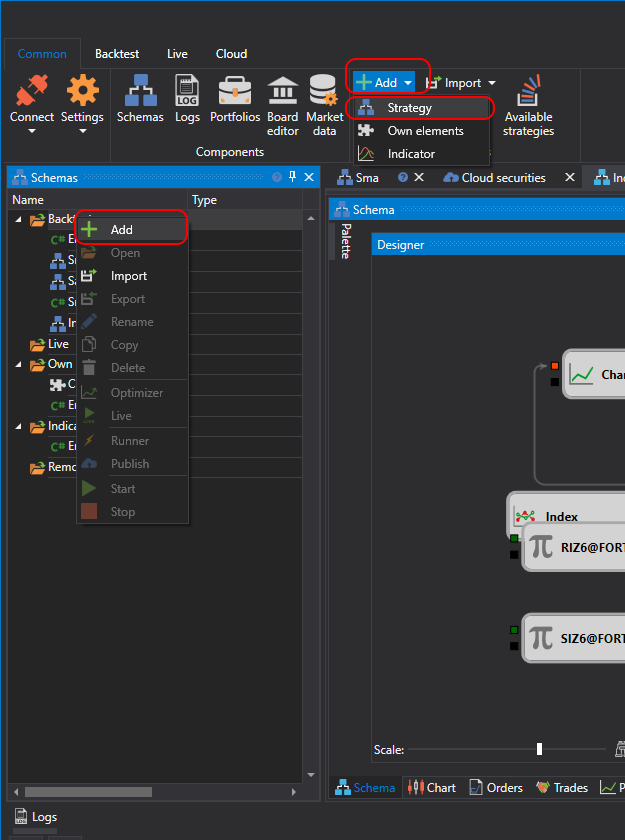
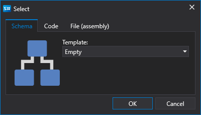
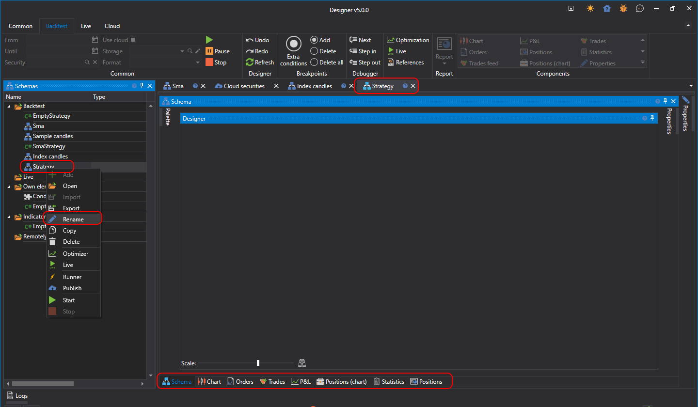

# Using Blocks

Using blocks does not require programming skills. The process of creating a strategy involves combining blocks and connections (lines), visually representing the entire workflow.

You can add a new strategy by pressing the **Add**  button in the **Common** tab and choosing **Strategy**. Or, by right-clicking on the **Strategies** folder in the **Scheme** panel, and pressing the **Add**  button in the dropdown menu:

After pressing the **Add**  button, a window will appear with a choice of content type to create the strategy on:

To create a strategy out of blocks, you need to select the **Scheme** tab. You can also choose a template that will be used as the initial scheme.

After pressing **OK**, a new strategy will appear in the **Strategies** folder of the **Scheme** panel. A new tab with the strategy will appear in the workspace, and upon navigating to it, the **Backtest** tab will automatically open in the ribbon. On the **Scheme** panel, right-clicking on the strategy opens a menu that allows you to rename the strategy, among other actions.

The strategy tab consists of the **Scheme** panel ([Strategy Designer](Designer_Designer_schemes_strategies_and_component_elements.md)), as well as other tabs that represent the [graphical components](Designer_Components.md) of the strategy, necessary for displaying the results of testing the strategy created in the **Scheme** area. Detailed information about strategy testing is described in the section [Example of backtesting](Designer_Example_of_backtesting.md).

## See Also

[Strategy Designer](Designer_Designer_schemes_strategies_and_component_elements.md)