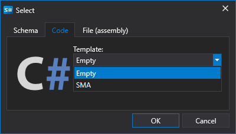
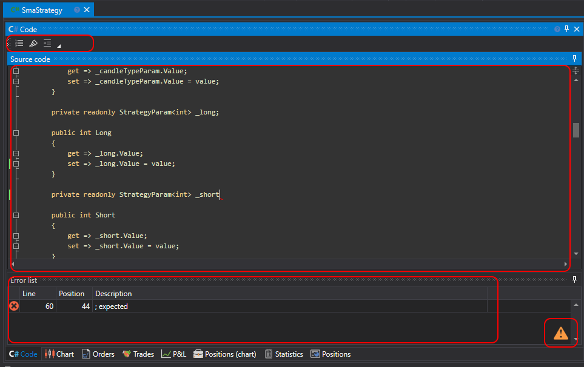
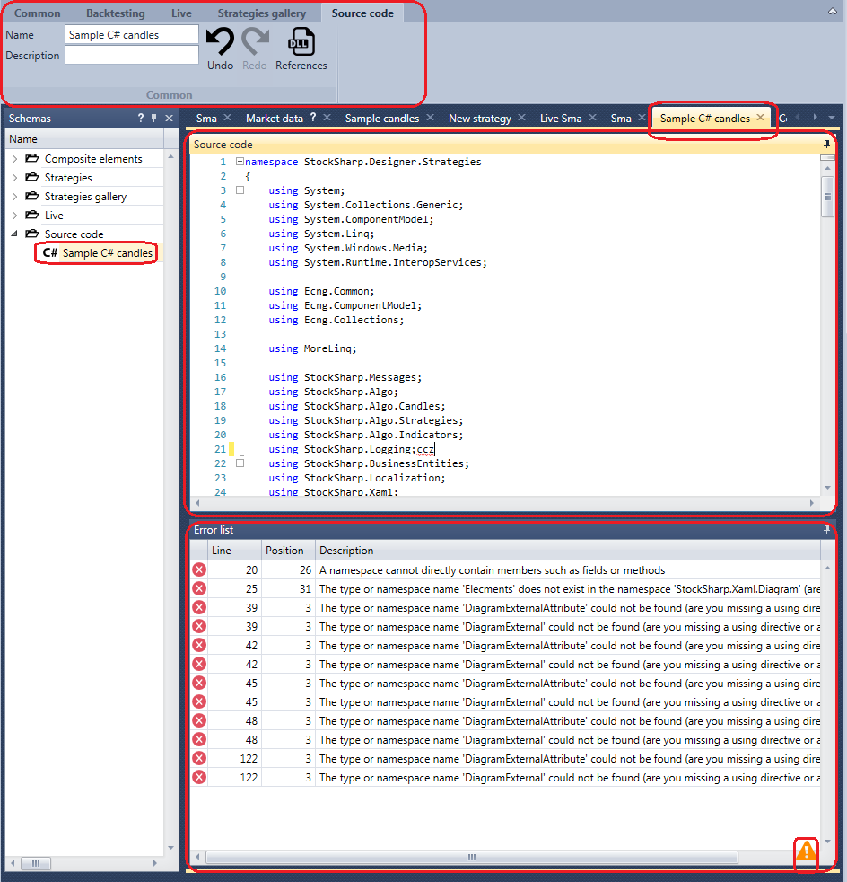

# Getting started

You can create your own cube in [Designer](Designer.md) by clicking the right mouse button on the **Source code** folder in the **Schemas** panel. In the menu that appears, select **Add** in case of creating a new strategy or **Import** in case of importing an already completed strategy.

Also in [Designer](Designer.md), you can create your own cube in the **Common** tab by clicking the **Add** button, and choose **Source code** in the appeared menu:

After the cube is created, a new cube will appear in the **Source code** folder of the **Schemas** panel, clicking on it with a double click, a tab with the name of the cube will appear in the workspace, and the **Source code** tab will automatically open in the ribbon. In the **Source code** tab, you can change the name of the cube, write a description to the cube, undo the last action, return the undone action, and add the Dll library by clicking the **References** button.

The tab of the new cube in the workspace consists of **Source code** and **Error list** panels. The **Source code** panel contains the cube source code. Each line of the source code is numbered, to the right of the numbering, the lines in which the changes were made are marked in color. The **Error list** panel is a table with a list of errors in the code, if you double\-click the error line, the cursor in the Source code panel will automatically set to the error point. When a new error in the code occurs, the  icon appears in the lower\-right corner of the **Error list** panel. When you create a new Source code cube in the **Source code** panel, the C\# code of the SMA strategy will be the same as the standard SMA strategy compiled from the cubes in the [First strategy](Designer_Algorithm_creation_of_elements.md) section.

## Recommended content

[First C\# strategy](Designer_Creating_strategy_from_source_code.md)
