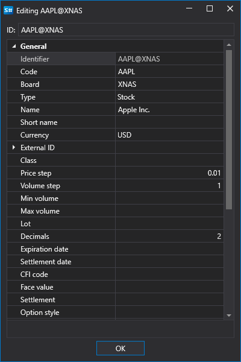

# Create instrument

Clicking the **Create security**  button opens the **Editing** window. To create a security, you should fill the security properties and click **OK** button:

Securities from different sources have unified identifiers. This is done so that the trading robot code does not depend on the connection type ([Connectors](API_Connectors.md)). The following syntax is used for the security identifier \- **\[security code\]@\[board code\]**. For example, for Apple shares NASDAQ stock\-exchange the identifier will be **AAPL@NASDAQ**.

## Recommended content

[Edit instrument](Designer_Edit_tool.md)
