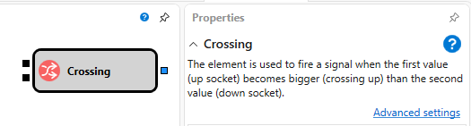
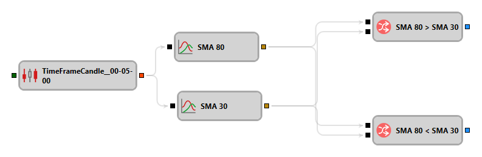

# Crossing

The element is used to track the position of two values relative to each other. For example, for the identification of the intersection of two lines (the moment when the previous value of the first line was less than the second one, and the current value of the first line is greater than the second one), or when the value crosses a certain level.

### Incoming sockets

Incoming sockets

- **Comparison** \- values that can be compared (for example, a numeric value, a string, an indicator value, etc.).
- **Comparison** \- values that can be compared (for example, a numeric value, a string, an indicator value, etc.).

### Outgoing sockets

Outgoing sockets

- **Flag** \- the flag value (indicated the state and has two values: up (true) and down (false)).

### Parameters

Parameters

- **Operator (Comparison)** \- the current value.
- **Operator (PrevComparison)** – the previous value.

The diagram of the composite element consists of simple elements and is based on memorization the current values (Prev In 1 and Prev In 2) and comparing the pairs, current (CurrComparison) and previous (PrevComparison) values with each other. Because each of the input values is used in two elements of the diagram, the elements of [Combination](Designer_Association.md) (In 1, In 2) are placed at the input of the composite element, and they allow one input to be divided into two elements and pass the input value to the [Comparison](Designer_Comparison.md) and [Prev value](Designer_Previous_value.md) elements. When a new value arrives at the input, the current values are compared and a new value is passed to the [Prev value](Designer_Previous_value.md) element, from which the previous value for the current input is passed, then the previous values are compared, and if both conditions are fulfilled, that is checked using the And logical condition, then the value of the raised flag is passed to the output of the composite element, which can be used as a trigger for further action.

## Recommended content

[Conditional operator](Designer_Conditional_operator.md)
