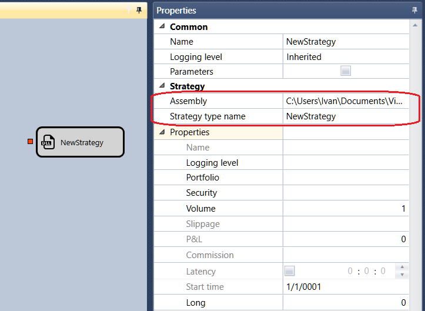

# DLL import

The cube is used to import DLL libraries with strategies ([Create DLL in Visual Studio](Designer_Creating_DLL_element_in_Visual_Studio.md)).

### Parameters

Parameters

- **Assembly** \- Dll library containing the strategy you want to add.
- **Name of strategy type** \- the name of the strategy type that you want to add.

## Recommended content

[Trades by strategy](Designer_Trades_strategy.md)
