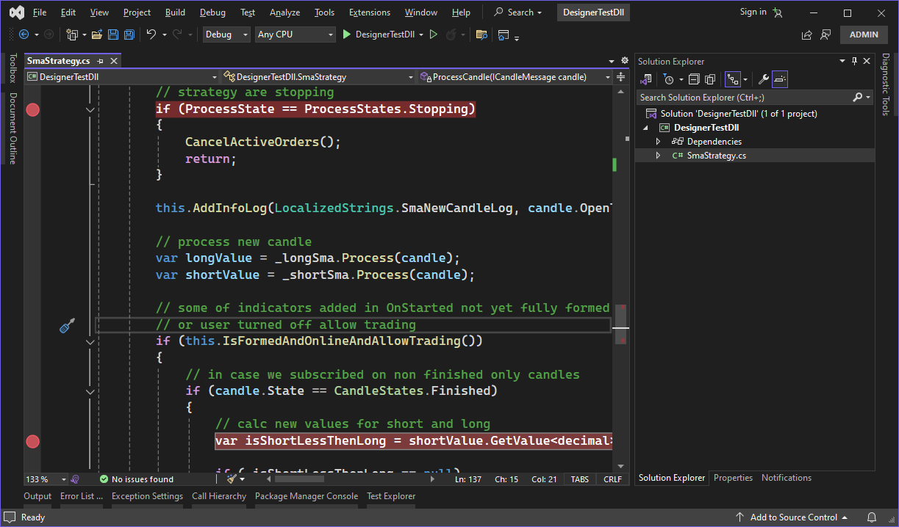

# Debug DLL in Visual Studio

There is a mechanism to attach to running processes using the Visual Studio debugger in Visual Studio. The most detailed description of the Visual Studio debugger is in the [Attach to process](https://msdn.microsoft.com/en-US/library/3s68z0b3.aspx) documentation. Further, debugging will be considered using the example of a cube created in [Create DLL in Visual Studio](Designer_Creating_DLL_element_in_Visual_Studio.md) section.

1. In order to attach to the process and start debugging the DLL cube, it is necessary that it be loaded into memory. Loading the DLL into memory occurs after selecting the strategy name in the **Strategy type name** field. After loading the DLL into memory, it will be possible to attach it to the process.

2. In Visual Studio, select **Debug \-\> Attach to Process** item.

3. Find the **Designer.exe** process that you want to attach in the **Available Processes** list of the **Attach to Process** dialog box.

If the process is running from a different user account, you should select the **Show processes for all users** check box.

4. It is important that in the **Attach** window the code type that you need to debug was specified. The default setting **Auto** tries to determine the code type to be debugged, but does not always correctly determine the code type. To manually set the code type, you should do the following:

- Click **Select** in the **Attach** field.
- In the **Select code type** dialog box, click the **Debug these code** types option and select the types for debugging.
- Click the **OK** button.

5. Click the **Attach** button.

6. In Visual Studio, you need to set breakpoints in code. If the breakpoints are red and filled with red  (and the Studio is in debug mode) then it means that correct version of dll was loaded. And if the breakpoints are red and filled with white  (and Studio is in debug mode), then it means that wrong version of dll was loaded.

7. In the example, the breakpoint is in the first line of the **public void ProcessCandle(Candle candle**) method. When you run the strategy in [Designer](Designer.md), as soon as the candle values start to be passed to the DLL cube, Visual Studio stops at the point where the breakpoint is set. Next, you can trace the code progress:

## Recommended content

[Export](Designer_Export_strategies.md)
