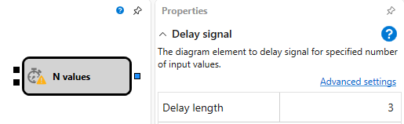
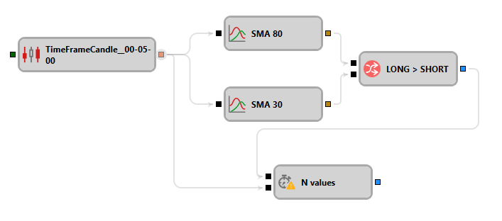

# Value Delay

This block is used to delay a value for N iterations.

#### Incoming Sockets

Incoming Sockets

- **Trigger** – initializes the internal counter for the delay countdown.
- **Input** - any incoming value that decreases the internal counter. When the counter reaches zero, it deactivates, and the outgoing socket is called. If the counter was not initialized by the **Trigger**, incoming values are ignored.

### Outgoing Sockets

Outgoing Sockets

- **Signal** – a flag notifying that the counter has reached zero.

### Parameters

Parameters

- **Delay length** - the duration of the delay.

## See Also

[Comparison](Designer_Comparison.md)