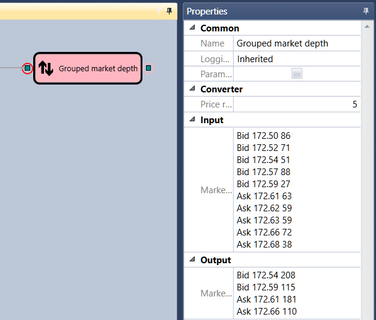

# Grouped order book

The cube is used to obtain a grouped order book. 

### Incoming sockets

Incoming sockets

- **Order book** \- the order book to be g rouped.

### Outgoing sockets

Outgoing sockets

- **Order book** \- the grouped order book.

### Parameters

Parameters

- **Price range** \- the price range in which orders will be grouped.

## Recommended content

[Sparse order book](Designer_Depth_Spread.md)
