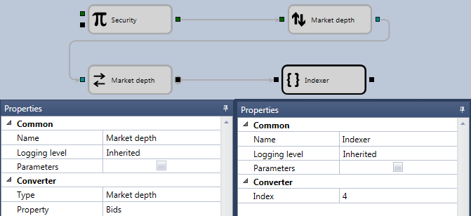

# Get order book price level

To get the required purchase string from the order book, the following schema can be used:

The **Instrument** data type is selected for the [Variable](Designer_Variable.md) cube. If the instrument is not specified, but the **Parameters** flag of the **Common** property group is set, then it will be taken from the strategy. For the [Converter](Designer_Converter.md) cube, the data type and the corresponding field of the cubes collection for Bids purchase are selected. The indexer cube gets required element from the collection of the best prices for the purchase. To get the certain price or volume value at a level, you can use the [Converter](Designer_Converter.md) cube.

## Recommended content

[Getting started](Designer_Creation_element_containing_source_code.md)
