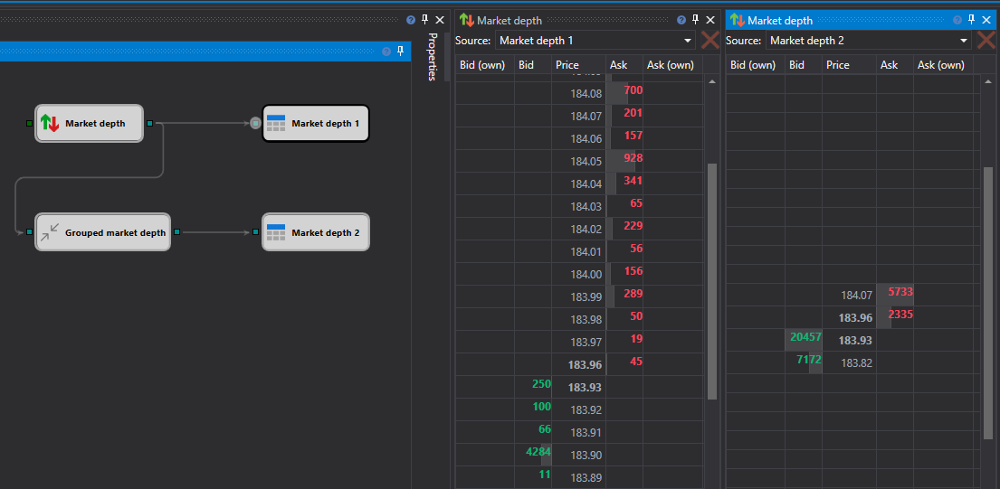

# Order book

The **Order book** component is a table of limit orders for the purchase and sale. At the top of the component, you should select the data source from which the data will be received. The source of the data is the [Order book panel](Designer_Depth_panel.md) cube. 

In the strategy, you can use several different types of order books (or from different instruments) simultaneously, and display them in different panels. 

## Recommended content

[Positions](Designer_Chart_Position.md)
