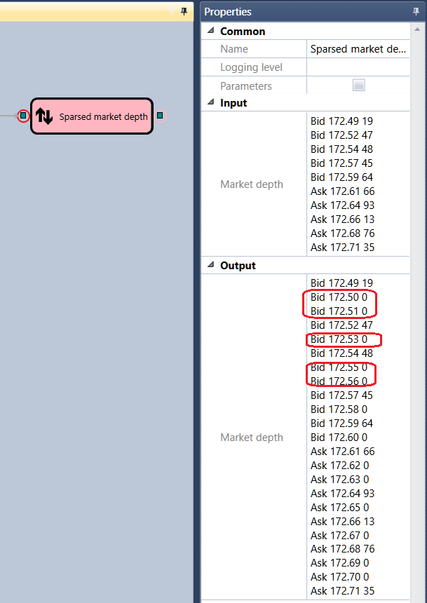

# Sparse order book

The cube is used to obtain a sparse order book by the specified one.

#### Incoming sockets

Incoming sockets

- Order book \- the order book that needs to be sparsed.

#### Outgoing sockets

Outgoing sockets

- Order book \- the sparse order book.

## Recommended content

[IV book](Designer_Depth_implied_volatility.md)
