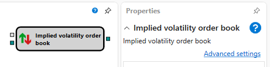

# IV book

The cube is used to calculate an order book of implied volatility.

#### Incoming sockets

Incoming sockets

- **Order book** – the order book.

#### Outgoing sockets

Outgoing sockets

- **Order book** \- the values of the order book of implied volatility.

## Recommended content

[Option desk](Designer_Options_Board.md)
