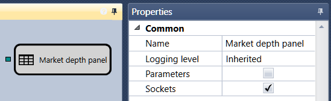

# Order book panel

The cube is designed to display an order book in a special graphic component [Order book](Designer_Depth_Panel2.md).

You need to add the [Order book](Designer_Depth_Panel2.md) component from the [Components](Designer_Components.md) group of the Emulation or Trade tabs. For more information on the [Order book](Designer_Depth_Panel2.md) component, see the [Order book](Designer_Depth_Panel2.md) clause.. 

### Incoming sockets

Incoming sockets

- **Order book** – an order book to be displayed.

## Recommended content

[Grouped order book](Designer_Depth_Grouped.md)
