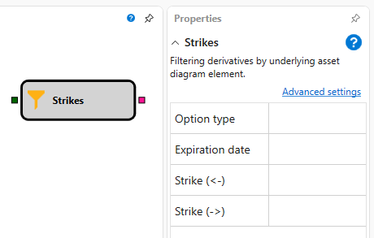

# Derivatives

The cube is used to obtain a list of options by a specified filter.

### Incoming sockets

Incoming sockets

- **Instrument** – the instrument, the underlying asset.

### Outgoing sockets

Outgoing sockets

- **Options** \- the list of options by the underlying asset.

### Parameters

Parameters

- **Option type** – the option type can be Call option or Put option.
- **Expiry date** \- expiry date of option.
- **Strike (less)** – the shift left (less) from the central strike. If the price is not set, then all strikes with a lower central value will be used. Shift is calculated in the strike steps, for example, if the strike step is 500 c.u., then the shift equal to 3 will be 1,500 c.u.
- **Strike (more)** – the shift to the right (more) from the central strike. If the price is not set, then all strikes with a larger central value will be used. Shift is calculated in the strike steps, for example, if the strike step is 500 c.u., then the shift equal to 3 will be 1,500 c.u.

## Recommended content

[Crossing](Designer_Crossing.md)
