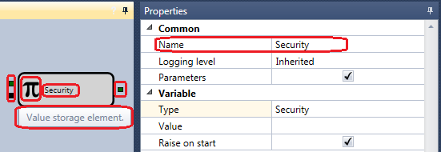
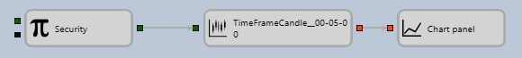

# Elements

Inside each cube, an icon is displayed that characterizes it, as well as a name that can be changed to a user\-defined one in the **Properties** panel. A tooltip for the cube shows a description of what this cube is for. When you select a cube with a mouse, you can view its properties in the **Properties** panel and, if necessary, change some parameters.

To the left and to the right of the cube, the colored boxes show the incoming (left) and outgoing (right) parameters.

Parameters are needed to fill the cube with information while the strategy is running. For example, for the [Candles](Designer_Candles.md) cube, the instrument for which you want to build a candle is passed to the input, and the built candles are returned at output. Which, in turn, can be used as an input parameter for the [Chart](Designer_Panel_graphics.md) element. Or to pass them to a method that determines the candle size.

The color denotes the type of data that is passed in the parameters. Different parameters in different cubes can receive and pass different and incompatible data types. The description of each parameter is indicated in the tooltip. To exclude a lot of errors when connecting parameters of different types, each parameter has its own data type, which differs in color. The following color set is used to indicate the parameters:

- **Black** – any type of data, usually used as a signal to perform certain actions within the element.
- **Darkgreen** – the instrument.
- **Darkturquoise** – the order book.
- **Turquoise** – the quote (a pair of price and volume).
- **Red\-orange** – candles.
- **Darkgold** – the indicator value.
- **Olive** – the order.
- **Olivegreen** – own trade.
- **Blue** – the flag value (indicates the state and has two values: up (true) and down (false)).
- **Aquamarine** – a numerical value, can be set as a number or percentage.
- **Greenforest** – values that can be compared (for example, a numeric value, a string, an indicator value, etc.).

Thus, you can connect the parameters of the same colors (the same data types), except for the following types of parameters:

1. 1. The **black** parameter can accept any data. Most often such parameters are used to pass signals for any actions inside the cube. For example, the[Variable](Designer_Variable.md) cube stores a certain value and sends it to the output when it receives a signal.
2. 2. The **green** parameter can receive on the input various comparable data types. For example, numeric, indicator values, strings, etc.

It should be noted that the parameter types can depend on the cube properties. For example, for the [Converter](Designer_Converter.md) cube, the input parameter type is automatically determined by the data source cube data type for [Converter](Designer_Converter.md). When you create a link, the color of the square on the element automatically changes.

Output parameters usually allow several outgoing connections to different cubes, the input parameters generally allow one connection, except for the [Combination](Designer_Association.md) cube, which allows you to merge the data stream from different cubes into one. The number of concurrent connections for a parameter is specified in the source code of the cube.

Cubes for building schemas are divided into several categories, each of the categories is intended for use in a certain part of the schema.

## Recommended content

[Chart](Designer_Panel_graphics.md)
