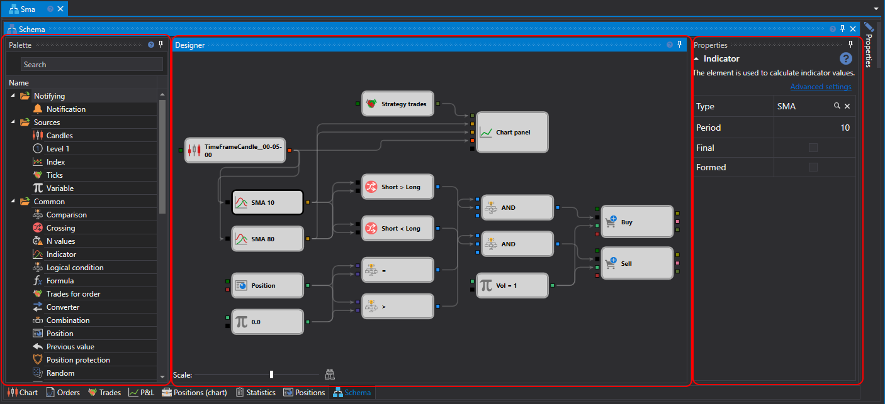
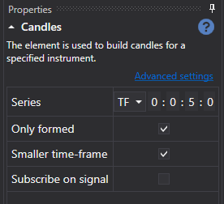

# Diagram panel

The main process of working on the design of strategy and composite elements is in the **Schemas** panel, by combining cubes and connecting lines. The Schemas panel consists of panels: **Palette**, **Designer**, **Properties**.

\_

### Palette panel

Palette panel 

The **Palette** panel contains the cubes from which the strategy is created. All the elements in the palette are divided into categories, which are described in the [Elements](Designer_Description_of_elements.md) section. To add a cube to the **Designer** panel, just right\-click on the required cube and, holding the mouse button, move it to the **Designer** panel. After that the element will be automatically selected and its parameters will be displayed in the window to edit the cube properties. 

### Designer panel

Designer panel

The entire process of creating a strategy is performed in the **Designer** panel by combining cubes and connections (lines). At that, the strategy diagram is presented visually. For details on creating a strategy, see [First strategy](Designer_Algorithm_creation_of_elements.md). 

### Properties panel

Properties panel

The Properties panel displays the parameters of the cube selected in the **Designer** panel. When you select a cube in the **Designer** panel, the frame around it is painted black. 

All cubes contain a set of predefined properties:

- **Name ** – the name of the element that is displayed in the designer.
- **Logging level ** – the logging level for this element.
- **Parameters ** – to display the element parameters in elements of a higher level.
- **Sockets ** – to display the element sockets in elements of a higher level.

Details about the properties of each cube are described in the [Elements](Designer_Description_of_elements.md) section.

## Recommended content

[Elements](Designer_Description_of_elements.md)
