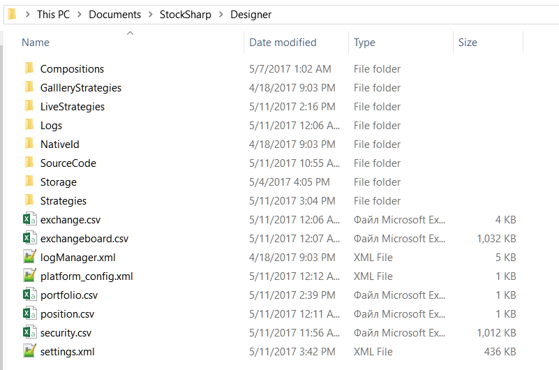

# Settings directory

The following directories are important for work with the [Designer](Designer.md):

1. The directory, where the [Designer](Designer.md), was installed, from this folder you can launch [Designer](Designer.md) by running the **Designer.exe** file. Or update Designer, by running the **Designer.Update.exe** file. Deleting this directory will delete Designer, however, the Designer settings will not be deleted.

2. The [Designer](Designer.md) settings directory is located in the folders of user's documents …\\StockSharp\\Designer\\ (for example, c:\\Users\\User\\Documents\\StockSharp\\Designer\\). Deleting this directory will cause all Designer settings to be reset to the default, **all created strategies and downloaded instruments and other information stored in the settings directory will be DESTROYED.**

This directory contains the following folders and files:

- The **Compositions** folder, containing in the form of XML files all cubes, contained in the Composite elements folder on the [Schemas](Designer_Panel_Schemas.md) panel. Deleting files from this directory will delete the **Composite element** from the **Composite elements** folder on the Schemas panel. You should not manually edit the files in this directory, this can lead to a malfunction of the corresponding **Composite elements** cube.
- The **LiveStrategies** folder, containing in the form of XML files all cubes, contained in the **Trading** folder on the [Schemas](Designer_Panel_Schemas.md) panel. Deleting files from this directory will delete strategy from the Trading folder on the Schemas panel. You should not manually edit the files in this directory, this can lead to a malfunction of the corresponding strategy.
- The **Logs** folder, containing all [Designer](Designer.md) logs, which simplifies the Designer troubleshooting.
- The **SourceCode** folder, containing in the form of XML files all cubes, contained in the SourceCode folder on the [Schemas](Designer_Panel_Schemas.md) panel. Deleting files from this directory will delete the **SourceCode** cube from the **SourceCode** folder on the **Schemas** panel. You should not manually edit the files in this directory, this can lead to a malfunction of the corresponding **SourceCode** cube.
- The **Strategies** folder, containing in the form of XML files all cubes, contained in the Strategies folder on the [Schemas](Designer_Panel_Schemas.md) panel. Deleting files from this directory will delete strategy from the **Strategies** folder on the Schemas panel. You should not manually edit the files in this directory, this can lead to a malfunction of the corresponding strategy. If you manually add a strategy file to this folder and reboot Designer, the strategy will appear in the **Strategies** folder on the **Schemas** panel.
- The **Storage** folder \- market data, downloaded by [Designer](Designer.md)into the corresponding [Market data storage](Designer_Repository_of_historical_data.md). The folder is created at the Market data storage creation. By default, the path is specified to this folder. Deleting this folder will delete all the downloaded market data from the corresponding storage. If the storage contains CSV format files, then they can be edited with a standard notepad or MS Excel. The BIN files cannot be edited manually.
- The **exchange.csv and exchangeboard.csv** files contain the list of **Stock Exchanges**, list of instrument codes and trading modes. These files can be edited with standard notepad or MS Excel.
- The **security.csv** file contains all received and created securities by all sources. Deleting this file will delete all securities in [Designer](Designer.md). Adding new instruments is described in [Download instruments](Designer_Download_instruments.md), [Create instrument](Designer_Creation_tool.md) sections. This file can be edited with standard notepad or MS Excel.
- The **portfolio.csv and position.csv** files contain all received and created portfolios and current position on them. D eleting this file will delete all corresponding data in [Designer](Designer.md). If information on portfolios is received by Designer at each connection, information on the positions can be lost irrevocably. These files can be edited with standard notepad or MS Excel.
- The **settings.xml** file contains current settings. This file is created by [Designer](Designer.md) when settings were changes or when at closing the program. Deleting this file will reset current settings to the default values. You should not manually edit this file, this can lead to a malfunction of [Designer](Designer.md).

If it is necessary to edit individual files or reset the Designer settings, it will be useful to backup both individual files and the entire directory.

## Recommended content

[Update to the new version](Designer_Update_to_new_version.md)
