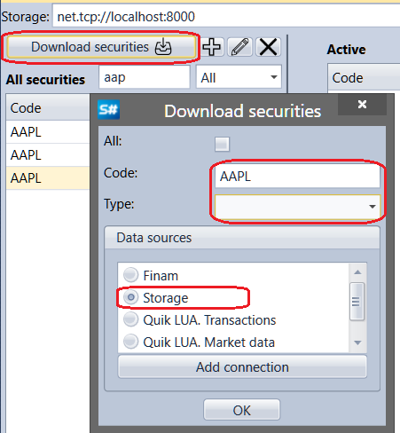

# Download instruments

Clicking the **Download securities** button opens the **Download securities** window. To download securities, you have to enter their code, type, select data source and click the **OK** button. [S\#.Designer](Designer.md) starts searching securities in the source. All found securities are added to the securities list on the **All securities** panel. If a storage is selected as the source, and the storage already contains downloaded securities, [S\#.Designer](Designer.md) will find all securities available in the storage. It may be useful, when the history on securities is already downloaded and copied to the storage folder.

Clicking the **Add connection** button opens the [Connections settings](Designer_Connection_settings.md) window.

## Recommended content

[Create instrument](Designer_Creation_tool.md)
