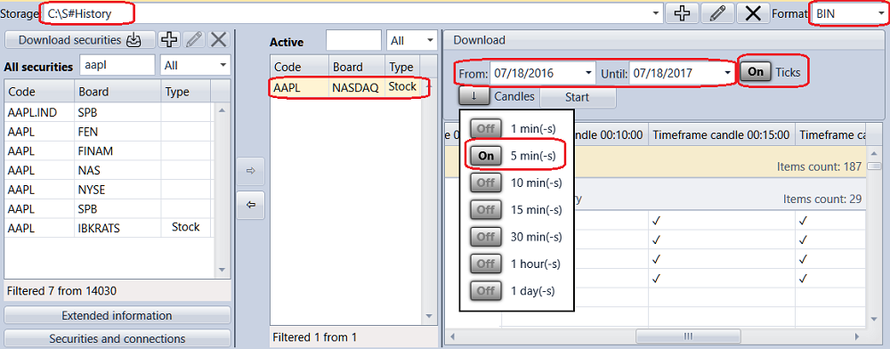

# Download market\-data

To get the historical data for the security, select the required security from the **All securities** list, move it to the **Active** securities list. Set the historical data period, select type and Time Frame for candles and click the **Start** button. All data will be saved in the [Market data storage](Designer_Repository_of_historical_data.md).

