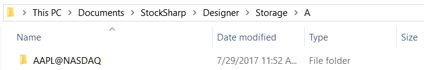
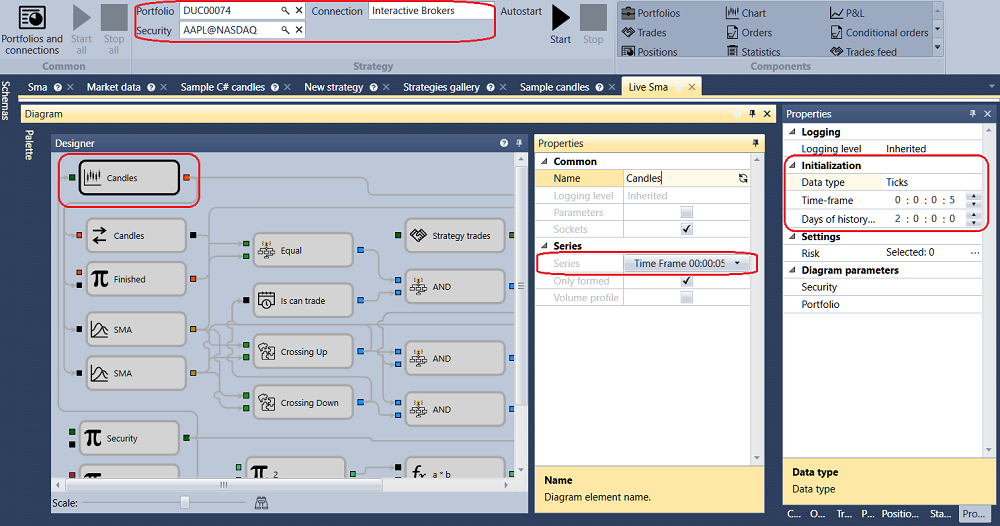
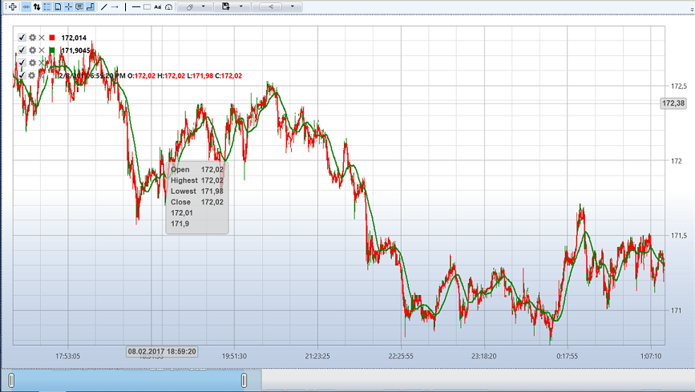
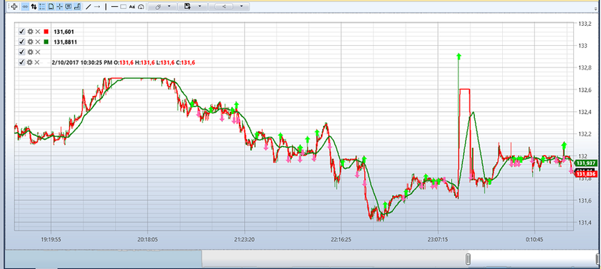

# Live execution sample

To run an example in **Live** you will need:

1. Testing terminal **IB Trader Workstation (TWS) Demo** from [Interactive Brokers](IB.md), you can get it on the manufacturer's website.

2. Set the IB TWS Demo terminal for work with [Designer](Designer.md). See the **IB TWS Setting demo** in the [Interactive Brokers](IB.md) section.

3. Set connection to the IB TWS Demo in [Designer](Designer.md) and connect.

4. Download history for the required instrument. For example, the **AAPL@NASDAQ** instrument will be used. The strategy will use candles with a time frame of 5 seconds, and history will not be needed, but such a history will be sufficient to demonstrate the possibility.

5. Set and run the strategy.

The following parameters will be used in the example with the SMA strategy.

- **AAPL@NASDAQ** instrument
- Standard storage **\\Documents\\StockSharp\\Designer\\Storage**
- Storage format \- **CSV**
- Type of data, taken from the storage \- **Ticks**
- Candles with time\-frame of 5 s
- Volume \- 100
- History days \- 2

After setting up all the required parameters, start up the strategy testing by clicking the  Start button.

After clicking the  Start button, the chart will start displaying the entire downloaded history for 2 days:

After downloading the entire history from the [Market data storage](Designer_Repository_of_historical_data.md) and the Table of anonymous trades from the terminal, the strategy will start trading.

The chart below shows the trades from [Designer](Designer.md).

## Recommended content

[Market data storage](Designer_Repository_of_historical_data.md)
