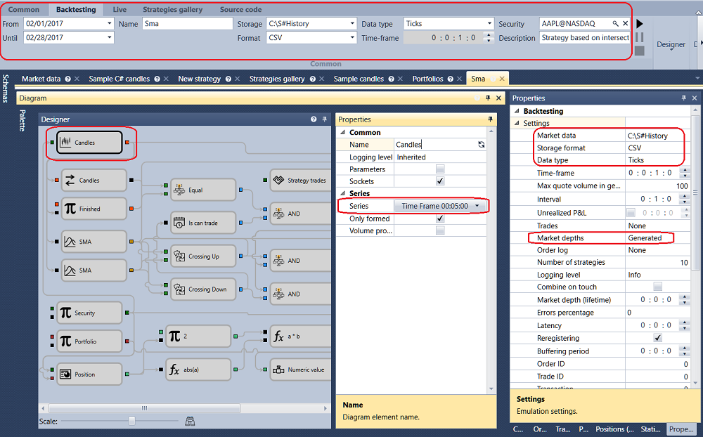
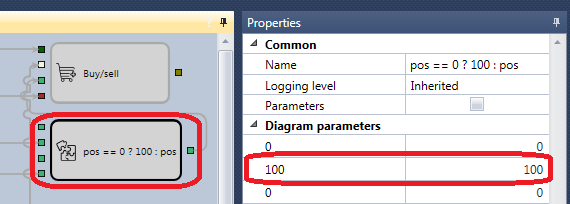
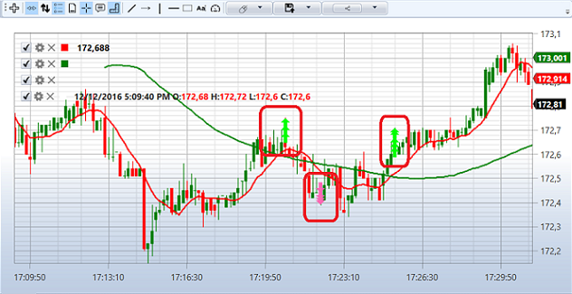
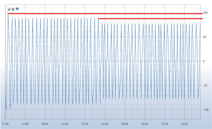
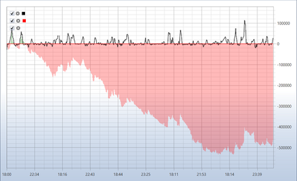

# Getting started

For the instance, the SMA strategy example will be considered.

To run the test on the history, you shall select a strategy, the scheme of which will be tested on the history. The strategy is selected on the [Schemas](Designer_Panel_Schemas.md) panel in the strategy folder, by double clicking on the strategy of interest.

Prior to testing, it is necessary to load market data (instruments, candles, tic trades and\/or order books)\/ The way to do that is described in the [Market data storage](Designer_Repository_of_historical_data.md) section.

When switching to the tab with a strategy, the **Emulation** tab automatically opens in the **Ribbon**. It is necessary to set the testing period on this tab. In the market\-data field specify the required storage ([Market data storage](Designer_Repository_of_historical_data.md)), in the instrument field specify the required instrument.

The following parameters will be used in the example with the SMA strategy.

1. AAPL@NASDAQ instrument
2. Standard storage \\Documents\\StockSharp\\Designer\\Storage
3. Storage format \- CSV
4. Type of data, taken from the storage \- Ticks
5. Order book \- generated
6. Order book depth \- 5
7. Spread size \- 2
8. Candles with time\-frame of 30 s
9. Volume \- 100

It is required to set the selected parameters up:

After setting up all the required parameters, start up the strategy testing by clicking the  button.

During or after the testing you can view chart and tables with the testing information.

The graph shows that the trades take place at the intersection of moving averages, as planned by the strategy. It can also be seen that orders are satisfied within several trades. It happens because of generated order book use, which increases the testing reality. The fact that orders are satisfied within several trades can be seen from the Trades tables, Statistics, and the Positions chart.

It can be seen on the **Positions chart**, that the strategy has decreased the volume operated. This happened because the generated order book has a depth of 5 and as a result, the entire order book depth was insufficient to satisfy the order of 200 lots. And since the strategy only reverses the position, every time the depth of the order book is not sufficient satisfy the order, the operated was reduced.

The **P\/L** chart indicates that the strategy is unprofitable with such parameters.

## Recommended content

[Live execution](Designer_Add_strategy_Live_trade.md)
