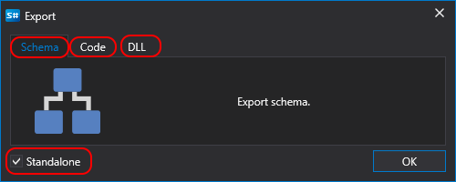

# Export

There are following ways to export a strategy:

- Right\-click the strategy on the **Schema** panel. Select **Export** in the appearing menu.
- On the **Common** tab click the **Export** button:

Clicking the **Export** button opens the **Export scheme** window, where you should specify the file name for exporting the strategy:

## Recommended content

[Export with encryption](Designer_Encryption.md)
