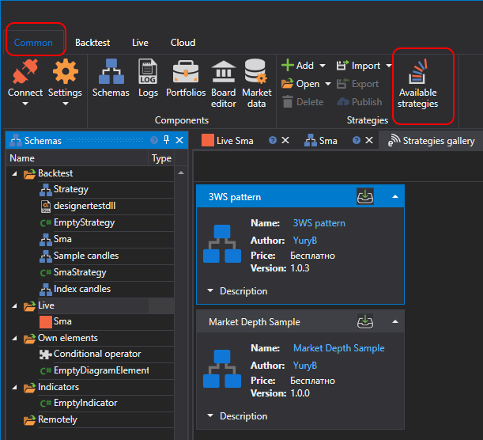

# Strategy gallery

**S\#** provides the opportunity to purchase ready\-made robots, developed by professional programmers from the **S\#** team or other participants of the **S\#** project. Anyone who wants to join the **S\#** project, who is ready to share knowledge and at the same time **earn money**, can [offer his robot to other market participants or buy a ready\-made robot in the store](https://stocksharp.com/robot/). 

To purchase ready\-made strategies, or offer your own strategies to other users, **S\#.Designer** has a **Strategy Gallery**.

The **Strategy gallery** is a simple and convenient way to acquire or publish strategies. The gallery contains a rich selection of ready\-to\-trade strategies. By choosing the right strategy, you can immediately run it in the trade, or perform tests on the history. Any user can publish his strategy ([Publish own strategy](Designer_Gallery_publish.md)) in the **Strategy** gallery, specify the strategy price and type of payment (one time, annual, monthly) and **earn money**, by selling or renting out his (her) strategies.

You can open the **Strategy gallery** by clicking the **Strategy gallery** of the **Common** tab. Or by double\-clicking the Strategy gallery folder on the [Schemas](Designer_Panel_Schemas.md) panel. Opening the Strategy gallery panel automatically opens the Strategy gallery tab:

The **Strategy gallery** tab displays the current balance, which can be used to acquire strategies. After clicking the **Fill up balance**[S\#.Designer](Designer.md) will redirect you to the page, where you can fill up the balance form a bank card of PayPal.

For quick search on the **Strategy gallery** tab there are **All strategies**, **Subscribed strategies**, **Free strategies**, **Own strategies** filters. After clicking the filter button, strategies corresponding to the filter name will remain in the **Strategy galleries** panel.

In order to get the selected strategy in the **Strategy gallery** folder on the [Schemas](Designer_Panel_Schemas.md) panel, select the strategy by clicking it in the Strategy gallery panel. The, click the **Subscribe button** on the **Strategy gallery** button. After clicking the **Unsubscribe** button, the selected strategy disappears from the **Strategy gallery** folder on the [Schemas](Designer_Panel_Schemas.md) panel.

## Recommended content

[Strategies](Designer_Creation_strategy.md)
