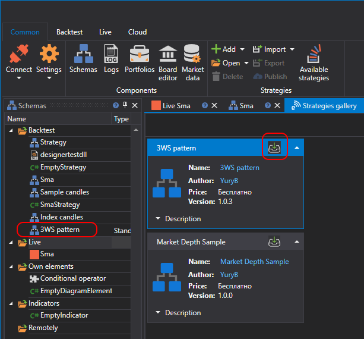
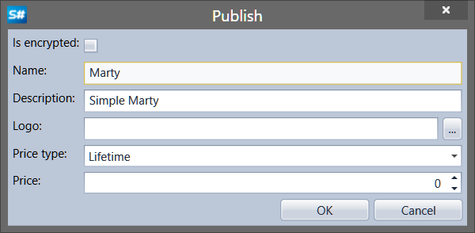
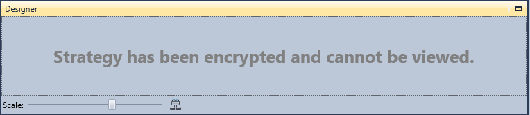

# Publish own strategy

You can publish your own strategy by left\-clicking the [Schemas](Designer_Panel_Schemas.md), panel and selecting Publish. Or, by switching to the strategy panel and clicking the **Publish** button on the **Backtesting** tab:

Clicking the **Publish** button opens the **Publish** window with the publishing parameters:

In the **Publish** window specify the strategy name, brief description, logo, price. Also, n the **Publish** window you can check the **Is encrypted** checkbox. After downloading the strategy published with the checked Is encrypted checkbox. The structure, code and used cubes will not be viewable. The **Designer** panel will display: **"Strategy has been encrypted and cannot be viewed"**. Also, see more on strategies encryption in the [Export with encryption](Designer_Encryption.md) section.

After clicking the **OK** button, the strategy will appear in the **Strategy gallery** panel. You can quickly find it by setting the **Own strategies** filter.
