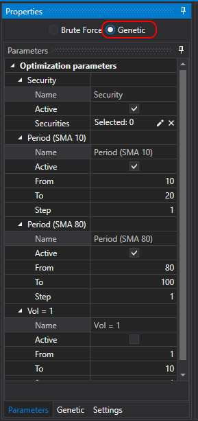

# Genetics

The **Designer** supports optimization both by the [brute force method](Designer_Optimization.md) and based on genetic algorithms. Genetic optimization significantly speeds up the process of finding optimal parameters.

To enable **Genetic** optimization, you need to:

- switch the mode:

  

- set the optimization parameters:

  

- as the target function (Fitness), you can specify an extended formula:

  

  For example, make calculations not only by **Profit** but also relative to its **Maximum Drawdown**. Available mathematical functions are similar to the [Formula](Designer_Universal_formula.md) block.

> [!TIP]
> Optimization through genetics is not deterministic. Therefore, determining the exact number of iterations and, consequently, the necessary total time is impossible, unlike [brute-force search](Designer_Optimization.md).